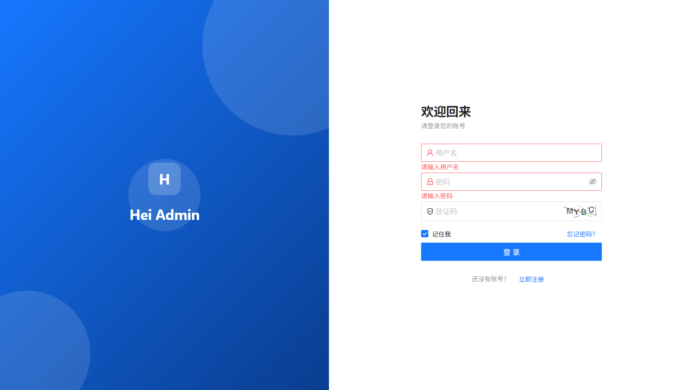
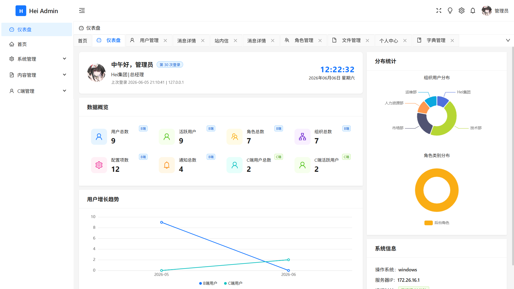
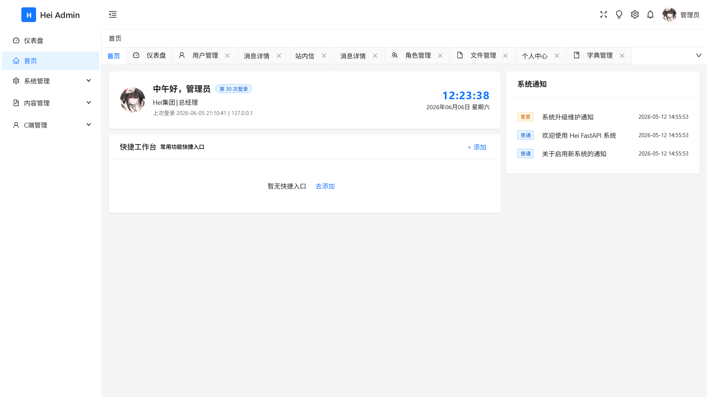

# Hei FastAPI


## 简介

**Hei FastAPI** 是 HEI 快速开发框架的 Python 单体应用版本，基于 FastAPI + SQLAlchemy 2.0 构建。采用 **插件化架构**，业务模块自包含于 `plugins/` 目录，自动注册路由、模型和权限，对标 hei-gin (Go) 的设计。

**在线文档**: [https://jiangbyte.github.io/hei-fastapi/](https://jiangbyte.github.io/hei-fastapi/)

## 预览







## 技术栈

| 类型 | 技术 |
| --- | --- |
| 核心框架 | Python 3.10+ / FastAPI 0.136+ / Uvicorn |
| 数据验证 | Pydantic v2 + Pydantic-Settings |
| ORM | SQLAlchemy 2.0 (Mapped + mapped_column) |
| 数据库 | MySQL 8.0+ (PyMySQL) |
| 缓存 | Redis 6.0+ (redis-py async) |
| 认证授权 | Token (Random String) / SM2 国密加密 / bcrypt 密码哈希 |
| 文件存储 | 本地文件系统 / MinIO / S3 兼容对象存储 |
| 分布式ID | Snowflake ID 算法 |
| 测试 | pytest + pytest-asyncio + httpx |

## 核心特性

- **插件化架构** — 业务模块自包含在 `plugins/` 目录，自动注册路由、模型、权限
- **双端认证体系** — B 端（后台管理）和 C 端（客户端）独立的两套 Token 认证
- **SM2 国密加密** — 登录密码传输使用国密 SM2 C1C3C2 模式加密
- **bcrypt 密码哈希** — 存储密码使用 bcrypt 加盐哈希
- **RBAC 权限控制** — 用户→角色→权限 + 用户直授权限，双层模型
- **数据权限** — 支持全部 / 本级及以下 / 本级 / 仅本人 / 自定义等 8 种粒度
- **权限自动发现** — `Perm("code", "name")` 自动注册权限并缓存到 Redis
- **文件存储抽象** — 统一接口，支持本地文件、MinIO、S3，一键切换
- **操作日志** — `@SysLog` 装饰器自动记录用户操作
- **防重复提交** — `@NoRepeat` 装饰器防止接口重复调用
- **链路追踪** — 基于 ContextVar 的 trace_id 全链路追踪
- **统一响应格式** — `{code, message, data, success, trace_id}`
- **雪花ID** — 分布式 Snowflake ID 生成器
- **定时任务** — 内置 Cron 调度器，支持 `@every 5m`、`@daily` 等规格
- **事件总线** — 异步 `@subscribe` / `await publish` 跨插件通信

## 项目结构

```
hei-fastapi/
├── main.py                          # 应用入口：create_app() → uvicorn.run()
├── .env                             # 环境配置（pydantic-settings 加载）
├── pyproject.toml                   # 项目元数据与依赖
├── requirements.txt                 # 锁定依赖版本
├── config/
│   └── settings.py                  # Pydantic-Settings 模型定义
├── core/                            # 框架核心
│   ├── app/
│   │   ├── setup.py                 # create_app() — 应用工厂
│   │   ├── lifespan.py              # 生命周期（DB/Redis/插件启停）
│   │   └── health.py                # 健康检查 GET /
│   ├── auth/                        # 认证与权限系统
│   │   ├── auth/                    # HeiAuthTool / HeiClientAuthTool
│   │   ├── decorator/               # @HeiCheckLogin, @NoRepeat 等
│   │   ├── permission/              # 权限匹配器、接口管理器
│   │   └── permission_scan.py       # 权限自动发现
│   ├── captcha/                     # 图形验证码
│   ├── constants/                   # Redis 缓存键、系统字段
│   ├── crud/                        # 通用 CRUD 辅助函数
│   ├── db/                          # MySQL + Redis 连接管理
│   ├── enums/                       # 枚举：状态、权限、资源等
│   ├── exception/                   # BusinessException
│   ├── log/                         # @SysLog 操作日志
│   ├── middleware/                  # Auth, CORS, Trace, Recovery, RateLimit
│   ├── plugin/                      # 插件框架
│   │   ├── interface.py             # HeiPlugin ABC + __init_subclass__ 自动注册
│   │   ├── registry.py              # 路由、中间件、权限注册
│   │   ├── loader.py                # 插件发现、加载、生命周期
│   │   ├── core_plugins.py          # 内置核心插件（auth, captcha, scheduler, utils）
│   │   └── event_bus.py             # 异步事件总线
│   ├── pojo/                        # 公共 POJO（IdParam, DateTimeMixin）
│   ├── result/                      # 统一响应格式
│   ├── scheduler/                   # Cron 定时任务调度器
│   ├── storage/                     # 文件存储抽象（Local / MinIO / S3）
│   └── utils/                       # 工具函数（SM2、Snowflake、IP 等）
├── plugins/                         # 业务插件
│   ├── __init__.py                  # 插件激活清单
│   ├── plugin_sys/                  # 系统管理插件
│   │   ├── plugin.py                # SysPlugin — 生命周期
│   │   ├── models.py                # 全局模型注册
│   │   ├── user/                    # 用户管理
│   │   ├── role/                    # 角色管理
│   │   ├── permission/              # 权限管理
│   │   ├── resource/                # 资源/菜单管理
│   │   ├── dict/                    # 数据字典
│   │   ├── config/                  # 系统配置
│   │   ├── banner/                  # 横幅管理
│   │   ├── log/                     # 操作日志
│   │   ├── notice/                  # 通知公告
│   │   ├── org/                     # 组织管理
│   │   ├── position/                # 岗位管理
│   │   ├── group/                   # 用户组管理
│   │   ├── file/                    # 文件管理
│   │   ├── home/                    # 首页快捷操作
│   │   ├── session/                 # 在线会话
│   │   ├── analyze/                 # 统计分析
│   │   └── auth/                    # 认证接口（captcha, sm2, username）
│   ├── plugin_client/               # 客户端插件
│   │   ├── plugin.py                # ClientPlugin
│   │   ├── user/                    # C 端用户管理
│   │   ├── session/                 # C 端会话
│   │   └── auth/                    # C 端认证
│   └── plugin_im/                   # 即时通讯插件
│       ├── plugin.py                # IMPlugin + WebSocket 路由
│       ├── ws/                      # WebSocket Hub / CrossHub / Client
│       ├── friend/                  # 好友管理
│       ├── group/                   # 群组管理
│       ├── message/                 # 消息管理
│       └── broadcast/               # 广播通知
├── cli/                             # CLI 工具
│   ├── codegen.py                   # 插件脚手架生成器
│   └── migrate.py                   # 数据库迁移工具
└── scripts/
    └── sqls/
        └── hei_ddl.sql              # 数据库建表 DDL
```

## 插件架构

每个插件是 `plugins/` 下的一个自包含目录，遵循 `HeiPlugin` 基类约定：

### 插件生命周期

```python
from core.plugin import HeiPlugin, PluginInfo, register_router

class MyPlugin(HeiPlugin):
    @classmethod
    def info(cls) -> PluginInfo:
        return PluginInfo(name="my_plugin", version="1.0.0", description="My plugin")

    def on_init(self):
        """应用启动时调用（DB/Redis 已就绪）"""

    async def on_start(self):
        """HTTP 服务器启动后调用"""

    async def on_stop(self):
        """优雅关闭时调用（逆序）"""
```

### 插件文件结构

```
plugins/plugin_xxx/
├── __init__.py          # 导入 plugin.py，触发自动注册
├── plugin.py            # HeiPlugin 子类 + register_router()
├── models.py            # HeiBase 子类（自动注册模型）
├── params.py            # Pydantic 请求/响应模型
├── dao.py               # 数据访问层
├── service.py           # 业务逻辑层
└── api/
    └── v1/
        ├── __init__.py
        └── api.py       # 路由定义（register_router(router)）
```

### 激活插件

编辑 `plugins/__init__.py`，添加一行即可激活：

```python
import plugins.plugin_sys      # 系统管理
import plugins.plugin_client   # 客户端
import plugins.plugin_im       # 即时通讯
# import plugins.plugin_xxx   # 取消注释即可启用新插件
```

## 快速开始

### 环境要求

- Python 3.10+
- MySQL 8.0+
- Redis 6.0+

### 安装依赖

```bash
pip install -r requirements.txt
```

### 配置

编辑 `.env` 文件，主要配置项：

```env
# 应用
APP__NAME=hei-fastapi
APP__HOST=127.0.0.1
APP__PORT=18885

# 数据库
DB__HOST=localhost
DB__PORT=3306
DB__USER=root
DB__PASSWORD=123456
DB__DATABASE=hei_data

# Redis
REDIS__HOST=localhost
REDIS__PORT=6379
REDIS__PASSWORD=123456

# Token
TOKEN__EXPIRE_SECONDS=2592000
TOKEN__TOKEN_NAME=Authorization

# SM2 密钥
SM2__PRIVATE_KEY=your-private-key
SM2__PUBLIC_KEY=your-public-key
```

### 初始化数据库

```bash
# 方式一：直接执行 DDL
mysql -u root -p hei_data < scripts/sqls/hei_ddl.sql

# 方式二：使用迁移工具（自动建表）
python -m cli.migrate --apply
```

### 启动服务

```bash
python main.py
```

或使用 uvicorn 热重载模式：

```bash
uvicorn main:app --reload
```

启动后访问：

- API 文档：<http://localhost:18885/docs>
- 健康检查：<http://localhost:18885/>

## CLI 工具

### 插件脚手架

```bash
# 列出所有插件
python -m cli.codegen list

# 创建新插件（生成 9 个文件，自动注册）
python -m cli.codegen scaffold plugin_xxx
```

生成的插件立即可以编译加载，只需填充业务逻辑即可。

### 数据库迁移

```bash
# 预览（dry-run）
python -m cli.migrate

# 执行
python -m cli.migrate --apply
```

## 认证体系

基于路径前缀分流，由 `AuthMiddleware` 自动识别认证上下文：

| 路径模式 | 认证方式 |
|---------|---------|
| `/docs`, `/redoc`, `/openapi.json` | 无认证 |
| `OPTIONS` | 无认证（CORS 预检） |
| `/api/v{n}/public/b/*`, `/api/v{n}/public/c/*` | 无认证 |
| `/api/v{n}/c/*` | HeiClientAuthTool（C 端） |
| `/api/v{n}/b/*` 及默认路径 | HeiAuthTool（B 端） |

## 装饰器参考

### 权限注册 + 校验

```python
from core.plugin import Perm

@router.get("/api/v1/sys/banner/page")
@Perm("sys:banner:page", "横幅分页")
async def page(...):
    ...
```

`Perm()` 同时完成两件事：
1. 注册权限到 `_perm_entries`，启动时自动发现并缓存到 Redis
2. 返回权限校验装饰器，运行时检查

### 操作日志

```python
from core.log import SysLog

@router.post("/api/v1/sys/config/create")
@SysLog("新增系统配置")
@Perm("sys:config:create", "新增系统配置")
async def create(...):
    ...
```

### 防重复提交

```python
from core.auth.decorator import NoRepeat

@router.post("/api/v1/sys/xxx/create")
@NoRepeat(interval=3000)  # 3 秒内禁止重复提交
async def create(...):
    ...
```

### 显式认证检查

```python
from core.auth import HeiAuthTool, HeiClientAuthTool

uid = await HeiAuthTool.getLoginId(request)           # B 端
uid = await HeiClientAuthTool.getLoginId(request)      # C 端
```

## API 规范

### 统一响应格式

```json
{
  "code": 200,
  "message": "请求成功",
  "data": {},
  "success": true,
  "trace_id": "xxxxxxxx-xxxx-xxxx-xxxx-xxxxxxxxxxxx"
}
```

### 分页响应

```json
{
  "code": 200,
  "message": "请求成功",
  "data": {
    "records": [],
    "total": 100,
    "current": 1,
    "size": 20
  },
  "success": true,
  "trace_id": "xxxxxxxx-xxxx-xxxx-xxxx-xxxxxxxxxxxx"
}
```

## 文件存储配置

框架支持三种存储后端，通过 `STORAGE__DEFAULT` 切换：

```env
# 默认（本地文件）
STORAGE__DEFAULT=LOCAL

# MinIO
STORAGE__DEFAULT=MINIO
STORAGE__MINIO__ENDPOINT=http://localhost:9000
STORAGE__MINIO__ACCESS_KEY=minioadmin
STORAGE__MINIO__SECRET_KEY=minioadmin

# S3 兼容
STORAGE__DEFAULT=S3
STORAGE__S3__BUCKET=my-bucket
```

## 权限数据链路

```
User ──→ RelUserRole ──→ Role ──→ RelRolePermission ──→ Permission
User ──→ RelUserGroup ──→ Group ──→ RelGroupRole ──→ Role ──→ ... ──→ Permission
User ──→ RelUserPermission ──→ Permission (直授)
```

多角色多路径下按最严策略合并（本人 < 自定义 < 本级及以下 < 本级 < 全部）。

## 相关项目

- **[Hei Gin](https://github.com/jiangbyte/hei-gin)** — Go 单体版本（设计对标的姊妹项目）
- **[Hei Boot](https://github.com/jiangbyte/hei-boot)** — Java Spring Boot 单体版本
- **[Hei Admin Vue](https://github.com/jiangbyte/hei-admin-vue)** — Vue3 前端管理后台

## 开源协议

本项目采用 [MIT License](LICENSE) 开源协议
