# HEI FastAPI


HEI FastAPI 是一个面向中后台、门户和通用业务系统的全栈脚手架。仓库包含 FastAPI 后端、管理端 Web
应用 `web/admin`、门户端 Web 应用 `web/portal`，以及对应的 uni-app 多端应用 `web/admin-uniapp`、
`web/portal-uniapp`。后端内置账号体系、RBAC、资源菜单、文件存储、消息通知、定时任务、数据库迁移和
基础可观测能力。

希望以现代 Python / Vue 技术栈，向 RuoYi（若依）开源生态致敬。

> 原先考虑英文优先，中文切换，但最终因为个人需求等原因，删除了 i18n 国际化支持。

## 功能概览

- 后端：FastAPI、SQLAlchemy Async、Alembic、Pydantic v2、Redis、RabbitMQ、Celery、Jinja2。
- Web 前端：Vue 3、Vite、TypeScript、Pinia、Naive UI / Pro Naive UI、UnoCSS、Monaco Editor。
- 多端前端：uni-app、Vue 3、Pinia、UnoCSS，可构建 H5 和常见小程序平台。
- API 统一挂载在 `/api/v1` 下，按 `admin`、`portal`、`internal` 入口组织。
- 内置 IAM/RBAC：账号、角色、部门、用户组、岗位、资源、权限注册与关系模型。
- 内置用户中心：管理端用户、门户用户、头像上传、资料修改、手机号修改。
- 内置系统能力：字典、Banner、文件管理、操作审计、本地/S3/MinIO/OSS 存储。
- 内置代码生成：支持普通表、树表、左树右表、主子表，生成 FastAPI 后端、管理端页面、API 和菜单权限 SQL。
- 内置消息能力：站内消息、通知、待办、实时事件接口。
- 内置后台任务：Banner 交互量定时落库、注销账号清理。
- 支持结构化日志、Prometheus metrics、OpenTelemetry tracing。

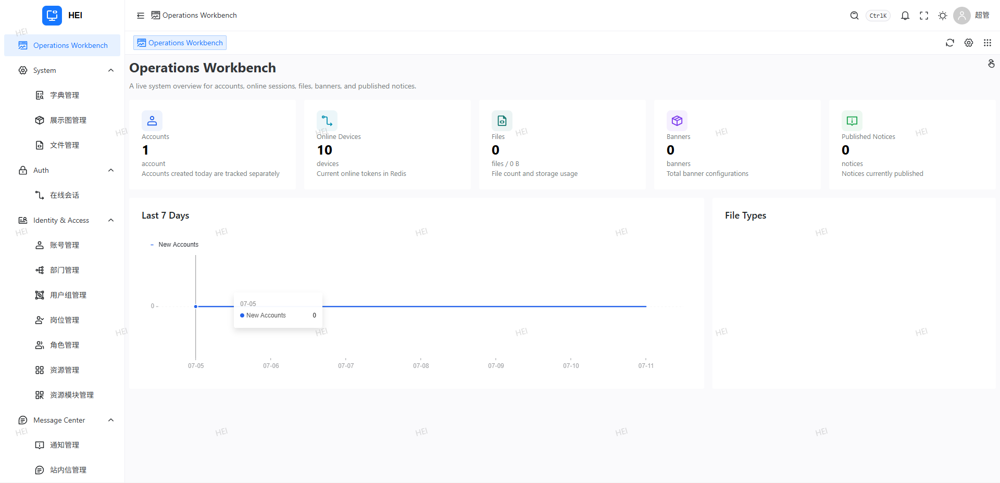

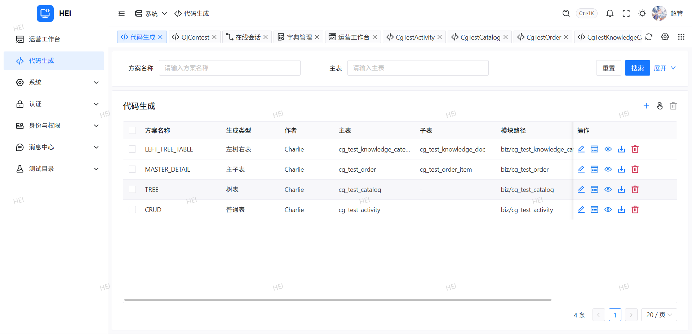

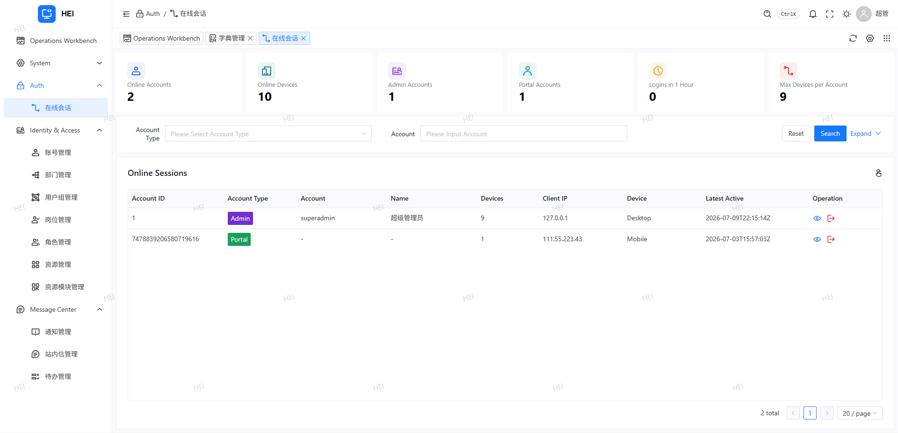

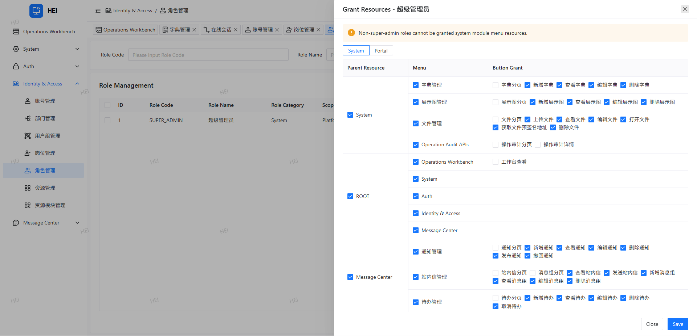

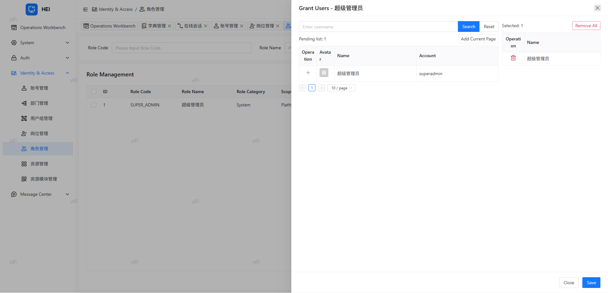

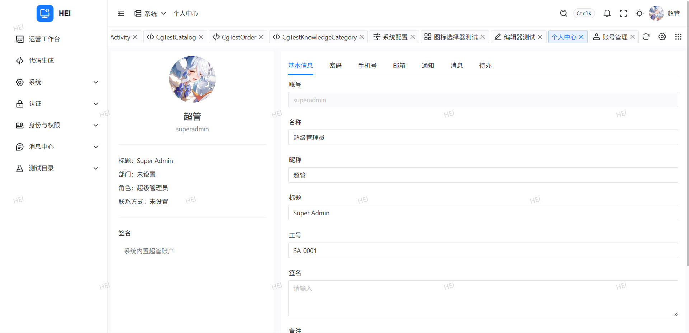

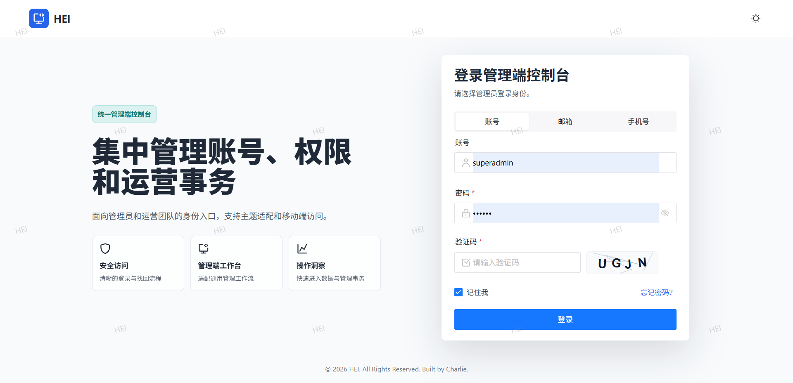

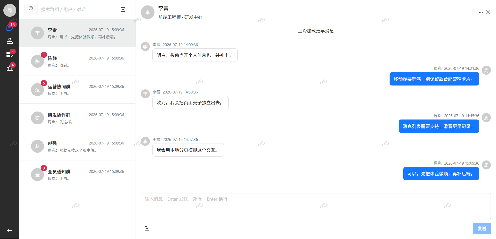

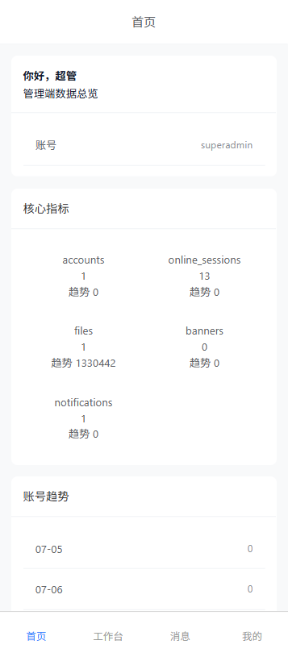

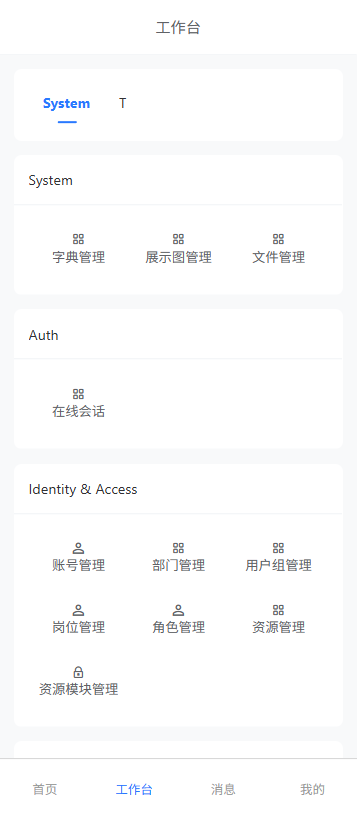

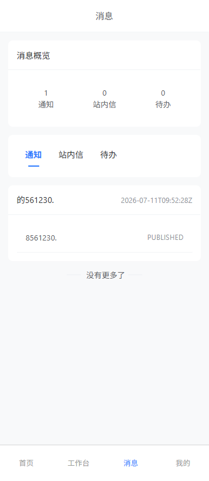

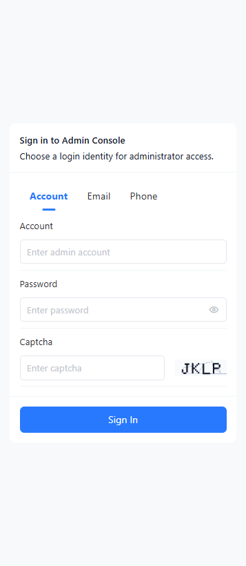

## 运行要求

后端开发环境：

- Python 3.11+
- PostgreSQL
- Redis
- RabbitMQ：启用 Celery worker/beat 时需要。

前端开发环境：

- Node.js 22+
- pnpm

可选依赖：

- S3 / MinIO / OSS：对象存储。
- Prometheus / OpenTelemetry Collector：可观测性。

## 快速启动

### 后端开发

```bash
python -m venv .venv
source .venv/bin/activate
pip install -e ".[dev,postgres]"
cp .env.example .env
vim .env
python scripts/migrate.py
python scripts/seed_super_admin.py
python scripts/dev.py
```

`.env.example` 是带注释的配置模板，复制后需要按本机环境取消注释并填写 `DB__URL`、`REDIS__URL`、
`CELERY__BROKER_URL` 和 `STORAGE__PROVIDER` 等关键项。轻量本地开发可以把存储切到 `local`。

默认后端地址为 `http://127.0.0.1:8000`，接口文档为 `/docs`。安装后也可以使用命令入口：

```bash
hei-fastapi
```

代码默认配置偏向本地开发：`APP__DEBUG=true`、`APP__WORKERS=1`、`CELERY__AUTO_START_ENABLED=true`。
FastAPI 启动时会在应用生命周期内拉起 Celery worker 和 beat。生产和 Docker 镜像默认关闭内嵌
Celery，建议拆分 API、worker、beat 容器运行。

### Web 管理端开发

```bash
cd web/admin
pnpm install
pnpm dev
```

默认开发配置：

```env
VITE_PORT=5173
VITE_HOME_PATH="/dashboard"
VITE_API_URL="http://127.0.0.1:8000"
```

### Web 门户端开发

```bash
cd web/portal
pnpm install
pnpm dev
```

默认开发配置：

```env
VITE_PORT=5163
VITE_HOME_PATH="/home"
VITE_API_URL="http://127.0.0.1:8000"
```

### uni-app 管理端开发

```bash
cd web/admin-uniapp
pnpm install
pnpm dev:h5
```

默认开发配置：

```env
VITE_PORT=5174
VITE_API_URL="http://127.0.0.1:8000"
```

### uni-app 门户端开发

```bash
cd web/portal-uniapp
pnpm install
pnpm dev:h5
```

默认开发配置：

```env
VITE_PORT=5174
VITE_API_URL="http://127.0.0.1:8000"
```

两个 uni-app 应用默认端口相同，同时运行时需要临时改其中一个目录的 `VITE_PORT`。

## 常用命令

后端：

```bash
python scripts/dev.py
python scripts/test.py
python scripts/lint.py
python scripts/migrate.py
python scripts/makemigration.py "describe schema change"
python scripts/check_migration.py
python scripts/seed_super_admin.py
```

前端：

```bash
cd web/admin
pnpm lint
pnpm build
pnpm preview

cd web/portal
pnpm lint
pnpm build
pnpm preview

cd web/admin-uniapp
pnpm lint
pnpm type-check
pnpm build:h5

cd web/portal-uniapp
pnpm lint
pnpm type-check
pnpm build:h5
```

## 配置

后端配置使用 `pydantic-settings`，支持嵌套环境变量，分隔符为 `__`。加载顺序为真实环境变量优先，
其次读取项目根目录 `.env` 和 `.env.local`。

常用配置项：

- `APP__HOST` / `APP__PORT`：监听地址和端口。
- `APP__DEBUG`：开发模式。开启时 Uvicorn reload 生效，并固定单 worker。
- `APP__WORKERS`：API worker 数，`0` 表示按 CPU 自动计算，受 `APP__WORKER_MAX` 限制。
- `DB__URL`：数据库连接地址，默认 PostgreSQL asyncpg。
- `DB__POOL_SIZE` / `DB__MAX_OVERFLOW`：单个进程的数据库连接池容量。
- `DB__POOL_TIMEOUT_SECONDS`：连接池获取连接超时时间。
- `DB__POOL_PRE_PING` / `DB__POOL_RECYCLE_SECONDS`：连接健康检查和回收，降低空闲断连影响。
- `AUDIT__OPERATION_QUEUE_SIZE`：操作审计异步写库队列容量，队列满会丢弃审计日志但不阻塞主请求。
- `REDIS__URL`：Redis 地址，用于会话、权限注册表、授权缓存、密码重置 token 和 beat lock。
- `MAIL__HOST` / `MAIL__PORT` / `MAIL__FROM_EMAIL`：SMTP 配置，用于忘记密码重置链接邮件。
- `MAIL__ADMIN_PASSWORD_RESET_URL` / `MAIL__PORTAL_PASSWORD_RESET_URL`：邮件中的重置密码前端链接地址。
- `CELERY__BROKER_URL`：RabbitMQ broker 地址。
- `CELERY__AUTO_START_ENABLED`：是否由 API 进程内嵌自启动 Celery worker/beat。
- `CELERY__WORKER_WITHOUT_MINGLE` / `CELERY__WORKER_WITHOUT_GOSSIP`：兼容新版 RabbitMQ 的 worker 启动选项。
- `STORAGE__PROVIDER`：文件存储方式，可选 `local`、`minio`、`s3`、`oss`。
- `STORAGE__PUBLIC_PATH`：本地文件公开访问前缀，默认 `/api/v1/files`。
- `STORAGE__LOCAL_ROOT`：本地存储根目录。
- `STORAGE__BASE_URL`：对象存储公开域名或 CDN 域名。
- `ID_GENERATOR__WORKER_ID` / `ID_GENERATOR__DATACENTER_ID`：雪花 ID 节点编号，多实例需避免重复。
- `SWAGGER__ENABLED`：是否开启 `/docs`、`/redoc`、`/openapi.json`。
- `OBSERVABILITY__ENABLED`：可观测性总开关。
- `OBSERVABILITY__METRICS_ENABLED`：是否暴露 metrics。
- `OBSERVABILITY__TRACING_ENABLED` / `OBSERVABILITY__OTLP_ENABLED`：是否启用 tracing 和 OTLP 导出。

默认值差异需要特别注意：

- 代码默认存储为 `s3`，`.env.example` 也按 S3/MinIO 给出完整模板。
- Dockerfile 默认覆盖为 `STORAGE__PROVIDER=local`、`STORAGE__LOCAL_ROOT=/app/storage`。
- 本地轻量开发可以使用 `local` 存储；多机部署不要依赖 Docker 本地 volume。

本地轻量配置示例：

```env
APP__DEBUG=true
APP__WORKERS=1
REDIS__URL=redis://127.0.0.1:6379/0
CELERY__AUTO_START_ENABLED=true
STORAGE__PROVIDER=local
STORAGE__PUBLIC_PATH=/api/v1/files
STORAGE__LOCAL_ROOT=storage
OBSERVABILITY__ENABLED=false
```

生产前端构建使用各自目录下的 `.env.production`。当前 `VITE_API_URL=""`，表示浏览器请求同源 `/api/`，
由前端容器内 nginx 反向代理到后端。前端 Docker 容器通过 `BACKEND_URL` 指定后端地址。

## Docker 部署

### 后端镜像

```bash
docker build -t hei-fastapi-backend .
```

后端镜像特点：

- 入口为 `CMD ["python", "-m", "app.main"]`。
- 入口不是固定单 worker；`app.main` 会读取 `APP__WORKERS` 并传给 Uvicorn。
- 镜像默认 `APP__DEBUG=false`、`APP__WORKERS=0`、`APP__WORKER_MAX=4`。
- `APP__WORKERS=0` 时按 CPU 自动计算 worker 数，并受 `APP__WORKER_MAX` 限制。
- 镜像默认 `CELERY__AUTO_START_ENABLED=false`，API 容器不会内嵌启动 Celery。
- 镜像默认本地存储 `/app/storage`，需要挂载 volume。
- 当前 Dockerfile 会复制构建上下文中的 `.env` 到镜像内；不要把生产密钥写进参与构建的 `.env`。
- 镜像只复制 `app/`，不复制 `scripts/`、`migrations/` 和 `alembic.ini`。
- 镜像不自动执行 Alembic 迁移，也不内置初始化超管脚本。

迁移和初始化建议在源码环境执行：

```bash
python scripts/migrate.py
python scripts/seed_super_admin.py
```

如需在容器内执行迁移或 seed，需要自行扩展镜像，额外复制 `alembic.ini`、`migrations/` 和 `scripts/`。

### 单容器轻量部署

只适合本地、演示或非常小的单机部署。API 会在进程内自启动 Celery worker/beat。此模式下 beat
会走项目内置 Redis lock，多个 API 实例同时启动时只有抢到锁的实例会启动 beat。

此模式必须固定 `APP__WORKERS=1`，否则一个容器内多个 API worker 都会进入应用生命周期，容易拉起多组
内嵌 Celery 进程。

```bash
docker run -d \
  --name hei-fastapi-server \
  --env-file .env \
  -e APP__DEBUG=false \
  -e APP__WORKERS=1 \
  -e CELERY__AUTO_START_ENABLED=true \
  -v hei-fastapi-storage:/app/storage \
  -p 8000:8000 \
  hei-fastapi-backend
```

### 单机单副本分离部署

用于验证角色拆分的最小形态：1 个 API 容器、1 个 worker 容器、1 个 beat 容器。API 不再内嵌 Celery；
worker 消费任务，beat 定时投递任务。

```bash
docker run -d \
  --name hei-fastapi-api \
  --env-file .env \
  -e APP__DEBUG=false \
  -e APP__WORKERS=1 \
  -e CELERY__AUTO_START_ENABLED=false \
  -v hei-fastapi-storage:/app/storage \
  -p 8000:8000 \
  hei-fastapi-backend

docker run -d \
  --name hei-fastapi-worker \
  --env-file .env \
  -e CELERY__AUTO_START_ENABLED=false \
  -v hei-fastapi-storage:/app/storage \
  hei-fastapi-backend \
  python -m celery -A app.worker.main:celery_app worker --without-mingle --without-gossip --loglevel INFO --pool solo --concurrency 1

docker run -d \
  --name hei-fastapi-beat \
  --env-file .env \
  -e CELERY__AUTO_START_ENABLED=false \
  -v hei-fastapi-storage:/app/storage \
  hei-fastapi-backend \
  python -m celery -A app.worker.main:celery_app beat --loglevel INFO --schedule /app/.runtime/celerybeat-schedule
```

### 多副本分离部署

多副本按角色扩容：

- API：可多副本，前面放 nginx / SLB。每个 API 容器内部也可通过 `APP__WORKERS` 启动多个 Uvicorn worker。
- Worker：可多副本，多个 worker 共同消费同一个 RabbitMQ 队列。
- Beat：必须单副本。直接运行 `celery beat` 不会经过项目内置 `CELERY__BEAT_LOCK_KEY`，多副本会重复投递定时任务。

示例：2 个 API、2 个 worker、1 个 beat。

```bash
docker run -d \
  --name hei-fastapi-api-1 \
  --env-file .env \
  -e APP__DEBUG=false \
  -e APP__WORKERS=0 \
  -e CELERY__AUTO_START_ENABLED=false \
  -v hei-fastapi-storage:/app/storage \
  -p 8001:8000 \
  hei-fastapi-backend

docker run -d \
  --name hei-fastapi-api-2 \
  --env-file .env \
  -e APP__DEBUG=false \
  -e APP__WORKERS=0 \
  -e CELERY__AUTO_START_ENABLED=false \
  -v hei-fastapi-storage:/app/storage \
  -p 8002:8000 \
  hei-fastapi-backend

docker run -d \
  --name hei-fastapi-worker-1 \
  --env-file .env \
  -e CELERY__AUTO_START_ENABLED=false \
  -v hei-fastapi-storage:/app/storage \
  hei-fastapi-backend \
  python -m celery -A app.worker.main:celery_app worker --without-mingle --without-gossip --loglevel INFO --pool solo --concurrency 1

docker run -d \
  --name hei-fastapi-worker-2 \
  --env-file .env \
  -e CELERY__AUTO_START_ENABLED=false \
  -v hei-fastapi-storage:/app/storage \
  hei-fastapi-backend \
  python -m celery -A app.worker.main:celery_app worker --without-mingle --without-gossip --loglevel INFO --pool solo --concurrency 1

docker run -d \
  --name hei-fastapi-beat \
  --env-file .env \
  -e CELERY__AUTO_START_ENABLED=false \
  -v hei-fastapi-storage:/app/storage \
  hei-fastapi-backend \
  python -m celery -A app.worker.main:celery_app beat --loglevel INFO --schedule /app/.runtime/celerybeat-schedule
```

多副本注意事项：

- 所有 API / worker / beat 必须使用同一组 `DB__URL`、`REDIS__URL`、`CELERY__BROKER_URL`。
- API 侧连接上限约为 `API 容器数 * 实际 APP worker 数 * (DB__POOL_SIZE + DB__MAX_OVERFLOW)`。
- worker / beat 也会创建数据库连接池，需要计入数据库最大连接数。
- 单机多容器可以共用 `-v hei-fastapi-storage:/app/storage`。
- 多机部署时 Docker 本地 volume 不共享，应改用 S3 / MinIO / OSS，或使用 NFS 等共享存储挂载到所有 API 和 worker。
- `CELERY__BEAT_LOCK_KEY` 只保护 API 内嵌自启动 beat 模式，不保护独立 `celery beat` 容器。
- 多实例部署时 `ID_GENERATOR__WORKER_ID` / `ID_GENERATOR__DATACENTER_ID` 应按实例规划，避免雪花 ID 节点重复。

## 前端 Docker

当前仓库只有 Web 管理端和 Web 门户端提供 Dockerfile；两个 uni-app 应用暂未提供 Docker 镜像。

Web 管理端：

```bash
docker build -t hei-fastapi-admin web/admin
docker run -d \
  --name hei-fastapi-admin \
  -e BACKEND_URL="http://host.docker.internal:8000" \
  -p 8081:81 \
  hei-fastapi-admin
```

Web 门户端：

```bash
docker build -t hei-fastapi-portal web/portal
docker run -d \
  --name hei-fastapi-portal \
  -e BACKEND_URL="http://host.docker.internal:8000" \
  -p 8082:80 \
  hei-fastapi-portal
```

前端镜像说明：

- 两个 Web 前端镜像都使用 Node 22 构建 `dist/`，再用 nginx 托管静态资源。
- Web 管理端容器内 nginx 监听 `81`，Web 门户端监听 `80`。
- nginx 官方镜像启动时会用 `envsubst` 渲染 `nginx/default.conf.template`。
- 浏览器请求同源 `/api/`，nginx 通过 `${BACKEND_URL}` 反向代理到后端。
- `CLIENT_MAX_BODY_SIZE` 可控制 nginx 上传体积限制，默认 `10m`。

## 项目结构

```text
app/
  api/          API 版本装配入口
  core/         配置、安全、日志、异常、统一响应
  deps/         FastAPI 依赖注入
  middleware/   中间件
  modules/      业务模块
  platform/     DB、Redis、HTTP、Celery、MQ、存储、可观测性等基础设施
  worker/       Celery app 入口与任务聚合
migrations/     Alembic 数据库迁移
scripts/        开发、测试、迁移和 seed 辅助脚本
  codegen_ddl_tests/ 代码生成测试表 DDL
tests/          单元测试和接口测试
web/
  admin/        Web 管理端 Vue 应用
  portal/       Web 门户端 Vue 应用
  admin-uniapp/ uni-app 管理端应用
  portal-uniapp/uni-app 门户端应用
```

## API 与模块机制

全局 API 聚合入口是 `app/api/router.py`。它会读取 `app/modules/**/module.py` 中的 `ModuleSpec`，
自动装配路由、模型、任务、定时任务和生命周期钩子。

运行时路径规则：

- 管理端：`/api/v1/admin/*`
- 门户端：`/api/v1/portal/*`
- 内部健康检查：`/api/v1/internal/*`
- 文件公开访问：默认 `/api/v1/files/*`

模块声明示例：

```python
from app.platform.module import ModuleSpec, RouteSpec

module = ModuleSpec(
    name="example",
    routes=(
        RouteSpec(
            version="v1",
            prefix="/admin",
            tags=("admin",),
            router="app.modules.example.router:router",
        ),
    ),
    models=("app.modules.example.model",),
    startup_hooks=("app.modules.example.lifecycle:startup",),
    shutdown_hooks=("app.modules.example.lifecycle:shutdown",),
)
```

新增 `v2` 接口时，在模块内追加 `RouteSpec(version="v2", ...)`，不需要修改全局 API 聚合文件。

## 内置模块

- `auth`：管理端/门户端登录、注册、退出、注销、找回密码、重置密码。
- `dashboard`：管理端首页统计。
- `iam.account`：账号、身份绑定、账号注销清理任务。
- `iam.role` / `iam.dept` / `iam.group` / `iam.position`：角色、部门、用户组、岗位。
- `iam.resource`：资源菜单、资源权限关系、门户端可见资源。
- `iam.permission`：权限注册表查询与权限键注册辅助。
- `iam.relation`：账号、角色、部门、用户组、岗位、资源等 IAM 关系模型。
- `user.admin` / `user.portal`：管理端和门户端用户资料。
- `sys.file`：文件管理和公开文件访问。
- `sys.dict`：系统字典。
- `sys.config`：系统配置管理。
- `sys.banner`：Banner 管理、门户展示、交互量定时落库。
- `sys.audit`：操作审计查询，写入通过有界队列异步处理。
- `sys.codegen`：代码生成方案管理、数据库表字段反射、字段配置、代码预览和 zip 下载。
- `message.message` / `message.notification` / `message.todo` / `message.realtime`：消息、通知、待办和实时事件接口。
- `biz.cg_test_*`：代码生成器验证用示例模块，对应 `scripts/codegen_ddl_tests/` 的测试表。
- `internal.health`：内部健康检查。

## 代码生成

管理端菜单路径为 `/sys/codegen`，后端接口挂载在 `/api/v1/admin/sys/codegen/*`。代码生成模块会读取当前数据库表结构和字段注释，保存生成方案和字段配置，并使用 Jinja2 模板渲染代码预览或 zip 包。

支持的生成类型：

- `TABLE`：普通 CRUD。
- `TREE`：树表，需配置父级字段和展示字段。
- `LEFT_TREE_TABLE`：左树右表，主表作为树，子表按外键分页查询。
- `MASTER_DETAIL`：主子表，主表分页，子表按主表 ID 查询。

生成内容包括：

- 后端模块：`model.py`、`schema.py`、`repository.py`、`service.py`、`router.py`、`module.py`。
- 管理端：API 文件和 `index.vue` 页面。
- SQL：菜单、按钮和权限关系 SQL。生成 SQL 中的资源和关系 ID 使用项目现有雪花 ID 生成器，不使用 md5/uuid。

当前实现默认只预览和下载 zip，不直接写入仓库目录。下载后按生成文件路径合并到项目，并补充对应 Alembic 迁移。

代码生成模块自身的表结构由 Alembic 迁移维护。

测试生成器可以导入 `scripts/codegen_ddl_tests/` 下的 PostgreSQL DDL：

- `01_crud_activity.sql`：普通表。
- `02_tree_catalog.sql`：树表。
- `03_master_detail_order.sql`：主子表。
- `04_left_tree_table_knowledge.sql`：左树右表。

## Celery 与 MQ

Celery app 入口：

```bash
app.worker.main:celery_app
```

当前内置定时任务：

- `banner.flush_interactions`：每 300 秒落库 Banner 交互量。
- `account.purge_cancelled_accounts`：每 86400 秒清理已注销账号。

RabbitMQ / Celery 兼容性说明：

- worker 默认添加 `--without-mingle --without-gossip`，并关闭 remote control。
- 这是为了避免新版 RabbitMQ 对 transient non-exclusive queues 的限制导致 worker 启动异常。
- async 任务体通过持久事件循环 runner 执行，避免在 Windows / Redis asyncio 场景出现 `Event loop is closed`。

项目还提供 `app.platform.mq` 作为普通 RabbitMQ 消费者封装。MQ consumer 默认不启动，需要配置
`MQ__ENABLED=true`，并在模块自己的 `startup_hooks/shutdown_hooks` 中启动和停止。

## 文件存储

支持 `local`、`minio`、`s3`、`oss`。

- `local`：文件写入 `STORAGE__LOCAL_ROOT`，访问 URL 使用 `STORAGE__PUBLIC_PATH`。
- `minio` / `s3` / `oss`：通过对象存储 SDK 上传，`STORAGE__BASE_URL` 为空时返回签名访问地址。
- 上传和删除存储对象时会放到线程池执行，避免阻塞 FastAPI 事件循环。
- 头像上传会按头像大小上限读取，避免无界读入内存。

Docker 默认使用本地存储并写入 `/app/storage`。单机部署请挂载 volume；多机部署建议改用对象存储。

## 数据库迁移

迁移只负责结构变更，不写入业务种子数据。详细说明见 [migrations/README.md](migrations/README.md) 和
[docs/migration.md](docs/migration.md)。

常规流程：

```bash
python scripts/makemigration.py "add xxx table"
python scripts/check_migration.py
python scripts/migrate.py
```

早期开发阶段如需重建完整初始迁移：

```bash
python scripts/rebuild_initial_migration.py --yes
```

初始化超管：

```bash
python scripts/seed_super_admin.py
```

默认账号和密码可通过环境变量或参数覆盖：

```bash
python scripts/seed_super_admin.py --help
```

## 测试与质量

```bash
python scripts/lint.py
python scripts/test.py
```

也可以直接运行：

```bash
ruff check app tests
pytest tests -q
```

## 扩展业务模块

新增业务建议放在 `app/modules/<module_name>` 下，并按现有模块组织：

```text
app/modules/example/
  __init__.py
  module.py
  model.py
  schema.py
  repository.py
  service.py
  router.py
```

典型流程：

1. 在 `model.py` 定义 SQLAlchemy 模型。
2. 在 `schema.py` 定义请求、响应和内部传输对象。
3. 在 `repository.py` 封装数据访问。
4. 在 `service.py` 编排业务逻辑和事务。
5. 在 `router.py` 暴露 FastAPI 路由。
6. 在 `module.py` 声明路由版本、前缀、模型、任务和生命周期钩子。
7. 如包含 Celery 任务，在 `tasks.py` 中定义并加入 `ModuleSpec.tasks`。
8. 如包含定时任务，在 `ModuleSpec.beat_schedules` 中声明。
9. 如包含新表，生成并检查 Alembic 迁移。

## 相关文档

- [docs/iam.md](docs/iam.md)：IAM 设计说明。
- [docs/migration.md](docs/migration.md)：迁移流程说明。
- [migrations/README.md](migrations/README.md)：Alembic 迁移约定。
- [web/admin/README.md](web/admin/README.md)：Web 管理端说明。
- [web/portal/README.md](web/portal/README.md)：Web 门户端说明。
- [web/admin-uniapp/README.md](web/admin-uniapp/README.md)：uni-app 管理端说明。
- [web/portal-uniapp/README.md](web/portal-uniapp/README.md)：uni-app 门户端说明。

## 参考项目

- [RuoYi](https://gitee.com/y_project/RuoYi) — 经典后台管理系统与开源生态，本项目在产品形态上向其致敬
- [snowy](https://gitee.com/xiaonuobase/snowy) — 国内首个国密前后分离快速开发平台

## 贡献指南

欢迎任何形式的贡献 — 提交 Issue、完善文档、修复 Bug、新增功能都行。

### 工作流程

1. **Fork 本仓库** — 在 [GitHub](https://github.com) 上 fork 到自己的账号下。
2. **克隆到本地**

```bash
git clone https://github.com/jiangbyte/hei-fastapi.git
cd hei-fastapi
```

3. **创建功能分支**

```bash
git checkout -b feat/your-feature-name
```

4. **开发与自测**

- 后端代码风格使用 Ruff（`ruff check app tests`）。
- 确保单元测试通过（`pytest tests -q`）。
- 如果涉及数据库变更，需生成对应的 Alembic 迁移。

5. **提交代码**

```bash
git add .
git commit -m "feat(scope): 简要描述改动"  # 推荐 Conventional Commits 风格
```

6. **推送并创建 Pull Request**

```bash
git push origin feat/your-feature-name
```

然后在 GitHub 上创建 Pull Request，目标分支为 `main`。PR 标题和描述请说明改动的动机和主要内容。

### 同步上游

开发过程中上游可能有新提交，建议定期同步：

```bash
git remote add upstream https://github.com/jiangbyte/hei-fastapi.git
git fetch upstream
git rebase upstream/main
```

### 说明

- Gitee、CodeUp 仅作为代码同步平台，所有贡献最终会合并到同一份代码中。
- 提交前请确保不与现有功能冲突，且通过基础 lint 和测试。
- 如有较大改动，建议先提交 Issue 讨论方向，避免重复劳动。

## License

本项目基于 **MIT License** 发布。关于 MIT 许可证的副本，请参见 [LICENSE](LICENSE)。

简单来说，你可以自由地：

- **学习交流** — 阅读、运行、修改源码，用于个人技术学习。
- **商用使用** — 按 MIT 许可证用于个人或企业项目；但当前仓库仍处早期阶段，不建议直接生产部署。
- **毕业设计** — 直接作为毕设项目或在其基础上扩展。
- **接单开发** — 作为自有脚手架用于外包项目、定制开发或二次开发交付。
- **教育培训** — 在教学场景中使用，或作为培训项目案例。
- **二次分发** — 分发修改版或衍生版，但需保留原始版权声明和许可证文本。

唯一的要求是保留原始的版权声明和许可证文本。作者不对本软件的适用性提供任何明示或暗示的担保。
