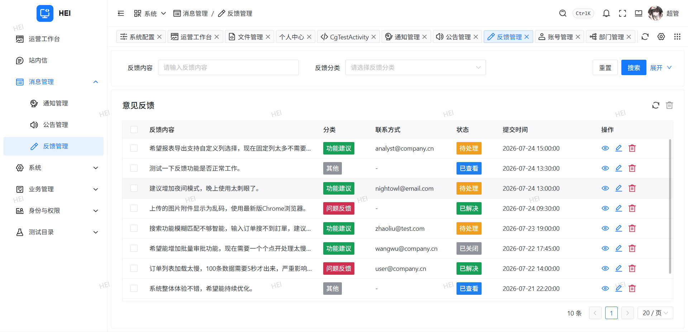
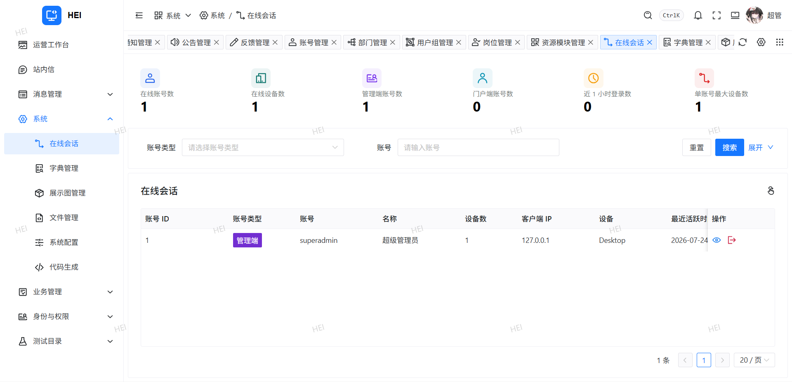
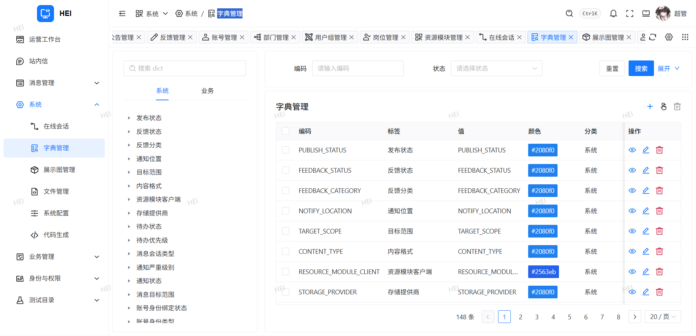
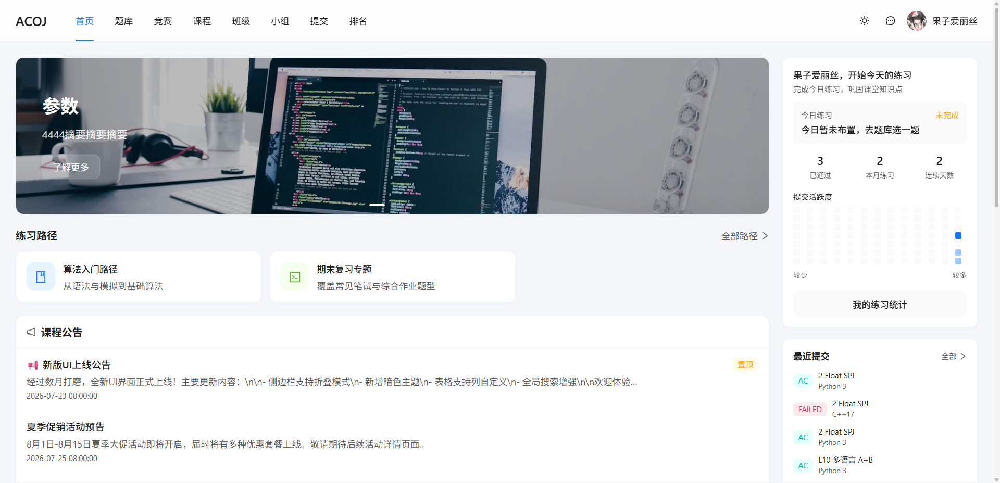
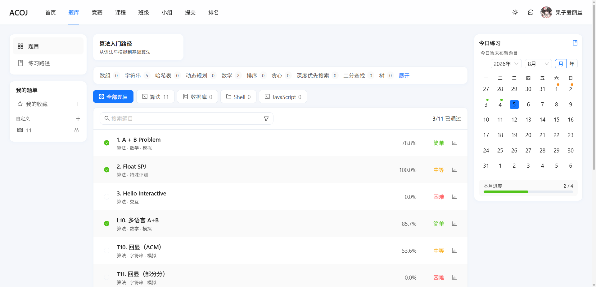
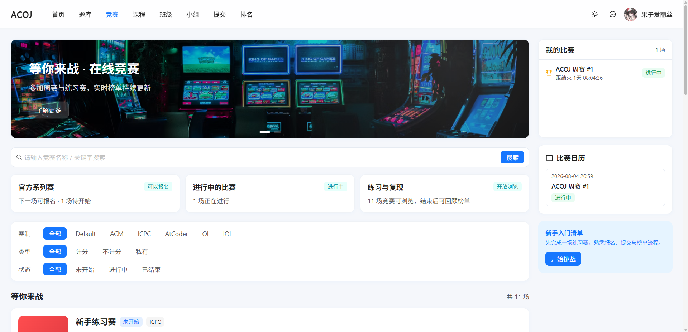
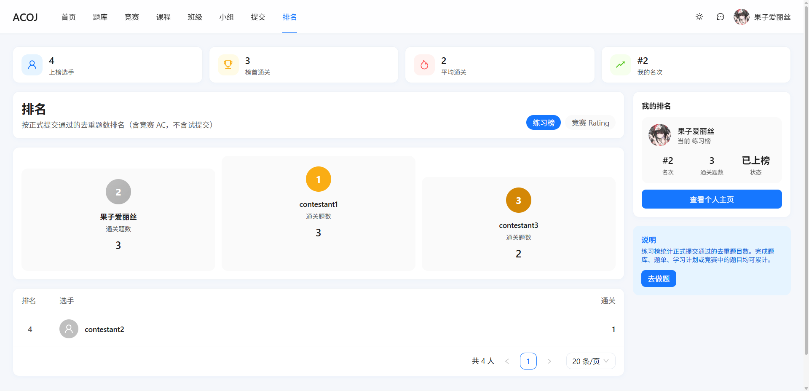
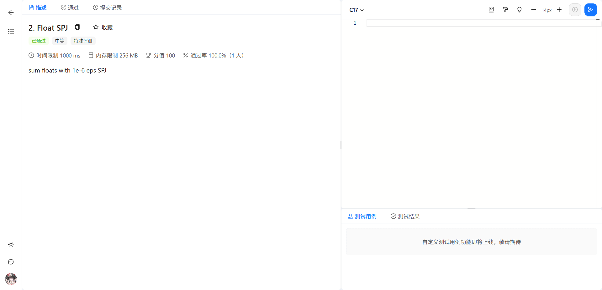
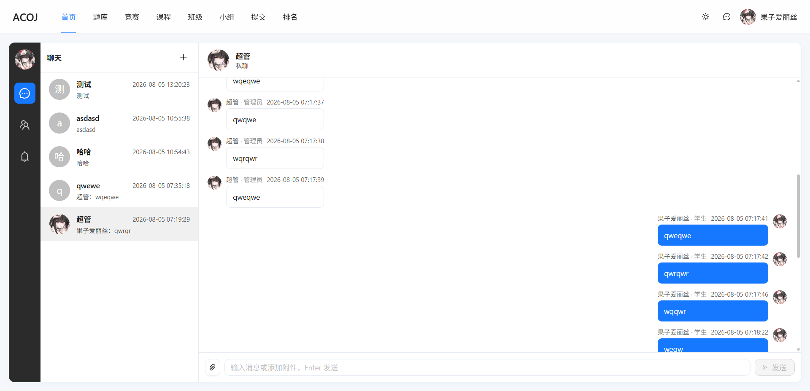

# ACOJ


ACOJ 是基于 FastAPI 的 Online Judge 平台：题库、提交判题、竞赛、班级/课程/小组教学，以及管理端与门户端。

> 由三个仓库组成：
> - **acoj**（本仓库）— Web 主站（API + Admin + Portal）
> - **[acoj-worker](https://github.com/jiangbyte/acoj-worker)** — 判题 Worker
> - **[acoj-sandbox](https://github.com/jiangbyte/acoj-sandbox)** — 判题沙箱
>
> 个人开发，有问题欢迎邮件：jiangbytebiz@163.com

---

## 功能概览

- **判题**：多语言提交、题目/用例管理、异步判题回调
- **教学**：班级、公开课/私有课、课内与独立小组、邀请码加入
- **竞赛**：比赛、报名、榜单、澄清
- **权限**：统一账号、RBAC（角色/部门/用户组/岗位/菜单）
- **系统**：文件存储（Local / MinIO / S3 / OSS）、字典、配置、代码生成
- **消息**：站内信、公告、IM、WebSocket
- **可观测**：结构化日志、Prometheus、OpenTelemetry

---

## 截图

### 管理端

| | |
|---|---|
|  |  |
|  |  |
|  |  |
|  |  |
|  |  |

### 门户端

| | |
|---|---|
|  |  |
|  |  |
|  |  |

---

## 技术栈

| 类别 | 技术 |
|---|---|
| 后端 | FastAPI / SQLAlchemy Async / Pydantic v2 / Gunicorn / Uvicorn |
| 数据库 | PostgreSQL（pgvector）/ Alembic |
| 缓存与队列 | Redis（API 缓存 + Celery broker/beat） |
| 对象存储 | MinIO / S3 / OSS / Local |
| 管理端 | Vue 3 / Naive UI / Vite / TypeScript |
| 门户端 | React 19 / Ant Design / Vite / TypeScript |

---

## 项目结构

```text
app/                 后端核心与业务模块
migrations/          Alembic 迁移
scripts/             migrate / seed / 运维脚本
web/admin/           管理端
web/portal/          门户端
docker-compose.oneclick.yml   一键本地部署（推荐）
```

---

## 一键部署（Docker Compose）

本仓库提供精简一键编排（API + 平台 Celery + Admin + Portal；不含判题 worker）：

```bash
cp .env.oneclick.example .env.oneclick
docker compose -f docker-compose.oneclick.yml --env-file .env.oneclick up -d
```

判题能力需另行部署 [acoj-worker](https://github.com/jiangbyte/acoj-worker)。

---

## 本地开发

### 后端

```bash
python -m venv .venv
source .venv/bin/activate
pip install -e ".[dev,postgres]"
# 需同级克隆 https://github.com/jiangbyte/acoj-sandbox 并安装 lang 包

cp .env.example .env
# 编辑 DB__URL、REDIS__URL、CELERY__BROKER_URL、APP__CONFIG_CRYPTO_KEY

python scripts/db/migrate.py
python scripts/db/load_bootstrap_sql.py
./entrypoint.sh          # 默认 all = API + worker + beat
```

- API：http://127.0.0.1:8000  
- Docs：http://127.0.0.1:8000/docs  
- 角色切换：`./entrypoint.sh api|worker|beat|migrate|seed`

### 管理端 / 门户

```bash
cd web/admin && pnpm install && pnpm dev    # 默认管理端
cd web/portal && pnpm install && pnpm dev   # 默认门户
```

---

## 配置边界

`.env` 只放部署与基础设施：监听地址、DB、Redis、Celery、CORS、加密 key。

运行态业务配置在库中：

- `sys_config`：上传限制、邮件等
- `sys_storage_config`：MinIO / S3 / OSS 连接信息（后台维护）

多实例时依赖 Redis 广播配置变更。

---

## 常用命令

```bash
python scripts/db/makemigration.py "describe schema change"
python scripts/db/migrate.py
python scripts/db/export_bootstrap_sql.py
python scripts/db/load_bootstrap_sql.py

python -m ruff check app tests
python -m pytest
```

本地构建示例（需同级 [acoj-sandbox](https://github.com/jiangbyte/acoj-sandbox)）：

```bash
DOCKER_BUILDKIT=1 docker build --build-context sandbox=../acoj-sandbox -t acoj-api:local .
DOCKER_BUILDKIT=1 docker build -t acoj-admin:local web/admin
DOCKER_BUILDKIT=1 docker build -t acoj-portal:local web/portal
```

---

## 相关文档

- [docs/iam.md](docs/iam.md)
- [docs/migration.md](docs/migration.md)
- [docs/production.md](docs/production.md)
- [migrations/README.md](migrations/README.md)
- [web/admin/README.md](web/admin/README.md)
- [web/portal/README.md](web/portal/README.md)

---

## License

MIT License。详见 [LICENSE](LICENSE)。
