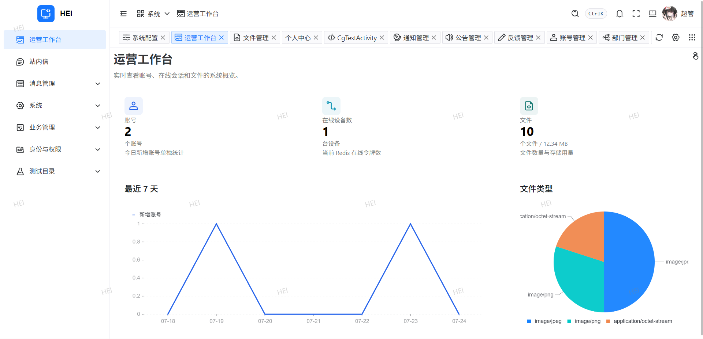
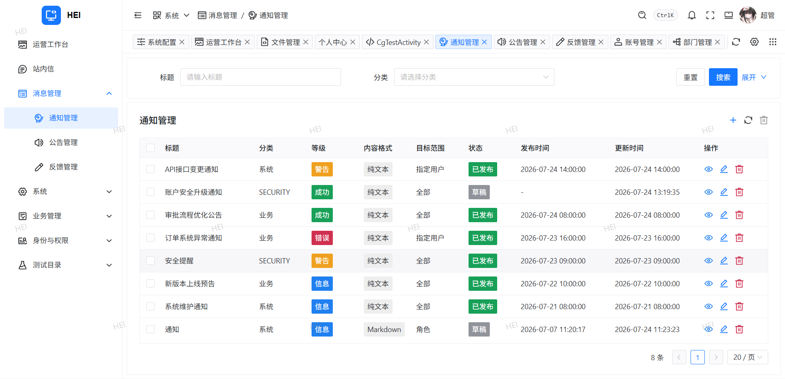
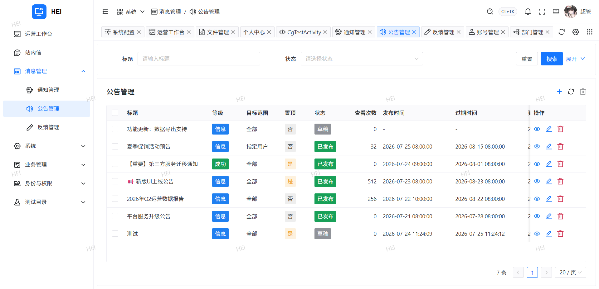
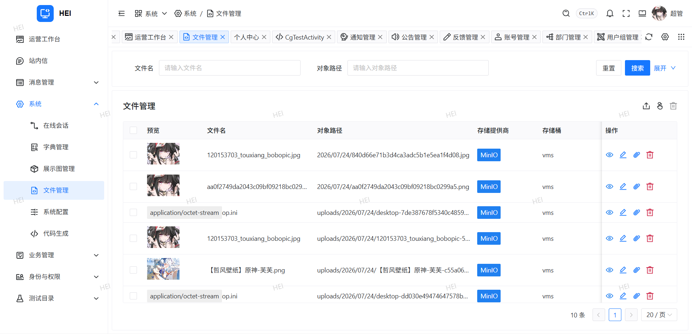
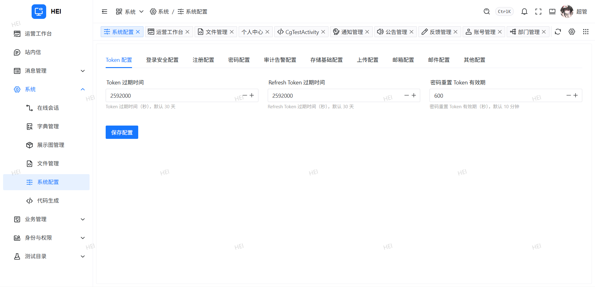
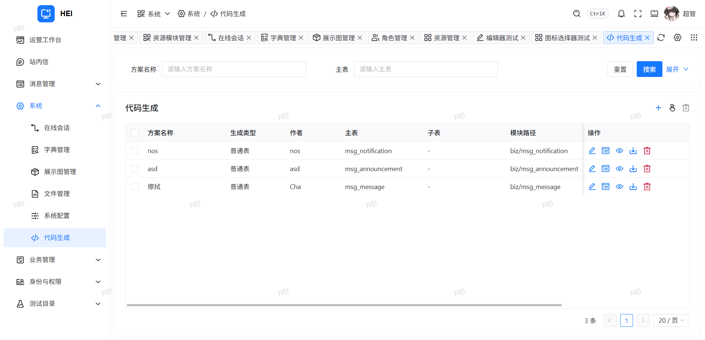
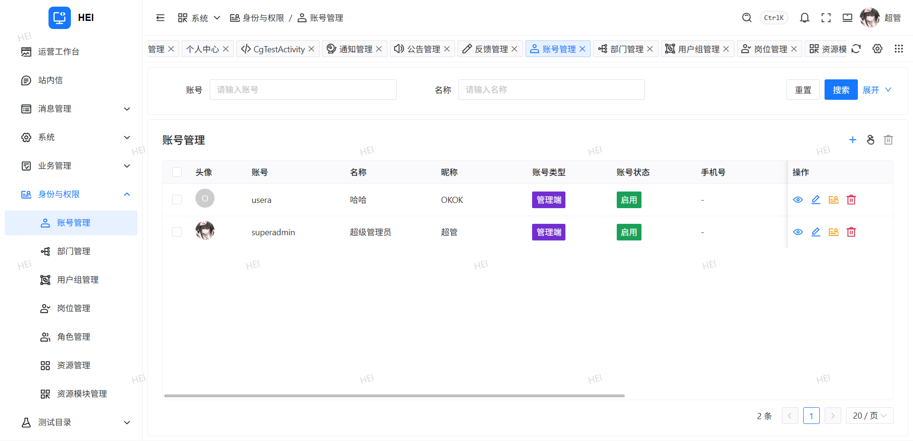

# HEI FastAPI


HEI FastAPI 是一个面向中后台和通用业务系统的全栈脚手架，包含 FastAPI 异步后端、Vue 3 管理端、Nuxt 4 门户端和 uni-app 管理端。

项目核心目标是提供一套可直接二次开发的基础工程：IAM/RBAC、系统配置、文件存储、消息通知、代码生成、任务调度、数据库迁移和可观测性都已经内置，业务模块通过 `ModuleSpec` 插件式装配，尽量减少对框架主体的侵入。

> 个人开发，有 bug 欢迎提，邮箱 jiangbytebiz@163.com

---

## 功能概览

- 异步后端：FastAPI / SQLAlchemy 2.0 Async / Pydantic v2
- 权限体系：账号、角色、部门、用户组、资源菜单、数据范围
- 系统能力：字典、配置、文件、Banner、审计、代码生成
- 消息能力：站内消息、通知、公告、反馈、WebSocket
- 文件存储：Local / MinIO / S3 / OSS
- 前端应用：Vue 3 管理端、Nuxt 4 门户端、uni-app 管理端
- 工程能力：Alembic、Celery、RedBeat、Docker、Prometheus、OpenTelemetry

---

## 截图

| | |
|---|---|
|  |  |
|  |  |
|  |  |
|  |  |
|  |  |

---

## 技术栈

| 类别 | 技术 |
|---|---|
| 后端 | FastAPI / SQLAlchemy Async / Pydantic v2 / Gunicorn / Uvicorn |
| 数据库 | PostgreSQL / MySQL / SQLite / Alembic |
| 缓存会话 | Redis |
| 任务队列 | Celery / celery-redbeat / RabbitMQ |
| 存储 | Local / MinIO / S3 / OSS |
| 管理端 | Vue 3 / Naive UI / Vite / TypeScript |
| 门户端 | Nuxt 4 / @nuxt/ui |
| 移动端 | uni-app |

---

## 项目结构

```text
app/
  core/          配置、安全、日志、异常、统一响应
  deps/          FastAPI 依赖注入
  middleware/    中间件
  modules/       业务模块，自动发现并装配
  platform/      DB、Redis、Storage、MQ、Celery、模块加载等基础设施
  worker/        Celery 入口
migrations/      Alembic 迁移
scripts/         开发、迁移、seed 辅助脚本
tests/           测试
web/
  admin/         Vue 管理端
  portal/        Nuxt 门户端
  admin-uniapp/  uni-app 管理端
```

---

## 快速开始

### 后端

```bash
python -m venv .venv
source .venv/bin/activate
pip install -e ".[dev,postgres]"

cp .env.example .env
# 编辑 .env：DB__URL、REDIS__URL、CELERY__BROKER_URL、APP__CONFIG_CRYPTO_KEY

python scripts/migrate.py
python scripts/seed_super_admin.py
./entrypoint.sh
```

默认地址：`http://127.0.0.1:8000`

接口文档：`http://127.0.0.1:8000/docs`

### 管理端

```bash
cd web/admin
pnpm install
pnpm dev
```

### 门户端

```bash
cd web/portal
pnpm install
pnpm dev
```

### uni-app

```bash
cd web/admin-uniapp
pnpm install
pnpm dev:h5
```

---

## 配置边界

`.env` 只放部署和基础设施配置，例如应用监听、数据库、Redis、RabbitMQ、CORS、加密 key。

运行态业务配置放在数据库中：

- `sys_config`：上传限制、邮件配置、模块运行参数等普通配置
- `sys_storage_config`：存储 provider、endpoint、bucket、access key、secret key 等连接配置

存储配置由管理后台维护并设置默认配置。上传接口可以只传 `storage_provider`，后端会解析到对应配置；需要精确指定时也支持 `storage_config_id`。

---

## 模块扩展

后端模块通过 `ModuleSpec` 声明式装配。新增业务模块通常只需要维护自己的 `router`、`model`、`schema`、`repository`、`service` 和 `module.py`。

外部业务模块包可通过环境变量追加扫描：

```bash
HEI_MODULE_PACKAGES=your_company.modules
HEI_DISABLED_MODULES=some.module
HEI_ENABLED_MODULES=some.module
```

推荐二次开发方式：

- 业务代码放在独立模块内，不直接改框架启动、路由聚合和基础设施代码
- 模块间协作优先使用 `app/platform/interfaces`
- 模块配置放在本模块配置模型或 `sys_config` 的模块名前缀下
- 存储连接统一走 `sys_storage_config`，不要在业务模块里硬编码 provider 密钥

---

## Docker

```bash
docker build -t hei-fastapi-backend .
docker run -d --name hei-fastapi-server --env-file .env -p 8000:8000 hei-fastapi-backend

docker build -t hei-fastapi-admin web/admin
docker run -d -e BACKEND_URL="http://host.docker.internal:8000" -p 8081:81 hei-fastapi-admin
```

---

## 常用命令

```bash
python scripts/makemigration.py "describe schema change"
python scripts/check_migration.py
python scripts/migrate.py

python -m ruff check app tests
python -m pytest
```

```bash
cd web/admin
pnpm build
```

---

## 相关文档

- [docs/iam.md](docs/iam.md)
- [docs/migration.md](docs/migration.md)
- [migrations/README.md](migrations/README.md)
- [web/admin/README.md](web/admin/README.md)
- [web/portal/README.md](web/portal/README.md)
- [web/admin-uniapp/README.md](web/admin-uniapp/README.md)

---

## License

MIT License。详见 [LICENSE](LICENSE)。
