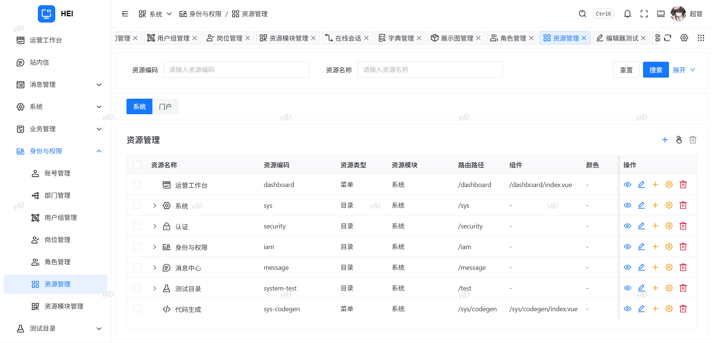
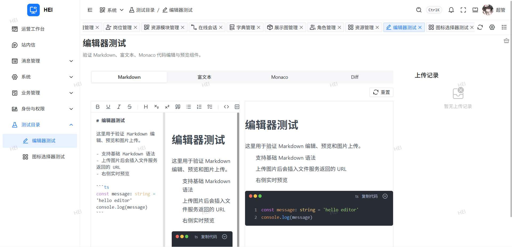
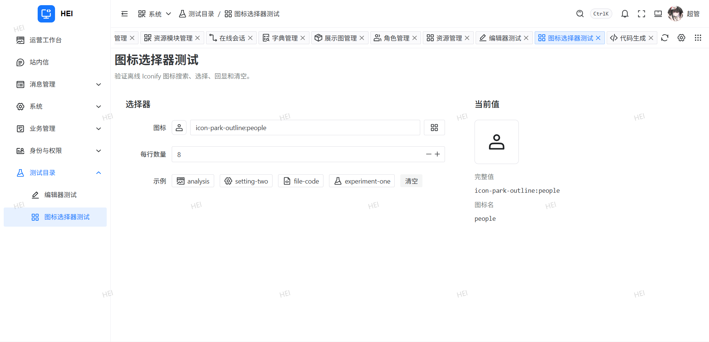

# HEI FastAPI


HEI FastAPI 是一个面向中后台、门户和通用业务系统的全栈脚手架。

仓库包含 **FastAPI 异步后端**、**Vue 3 管理端 SPA**、**Vue 3 门户端 SPA** 以及对应的 **uni-app 多端应用**。后端内置完善的 IAM/RBAC、资源菜单、文件存储、消息通知、代码生成、定时任务、数据库迁移和可观测性能力。

> 目前前端路由为静态资源（方便快速开发），sql 需要捣鼓一下（ai 处理生成），个人开发，有 bug 欢迎提，邮箱 jiangbytebiz@163.com
> 
---

## 功能亮点

**后端**
- FastAPI 异步框架 + SQLAlchemy 2.0 Async + Pydantic v2
- 模块化自动装配：新增模块只需定义 `ModuleSpec`，无需修改中央路由
- Alembic 数据库迁移、Celery 异步任务 + redbeat 定时调度
- 支持 PostgreSQL / MySQL / SQLite 多数据库

**IAM / RBAC**
- 统一账号体系（`sys_account` + `sys_account_identity`），支持 ADMIN / PORTAL 双端隔离
- 角色、部门、用户组、岗位、资源菜单完整分层
- 统一多态关系模型 `sys_iam_relation`，支持 allow/deny/数据范围/过期
- 会话管理：Redis Token、IP 绑定、并发限制、空闲超时
- 密码策略：复杂度、过期、历史检查、常见密码检测
- 登录安全：短信/邮箱验证码、RSA 加密、暴力破解防护、审计告警

**系统能力**
- 字典管理、系统配置（DB 运行时覆盖）、Banner 管理
- 文件管理：本地存储 / S3 / MinIO / OSS 多后端适配
- 操作审计：有界异步队列写库 + Celery 定时告警分析
- 代码生成：支持普通表、树表、左树右表、主子表，生成后端 + 前端 + 菜单 SQL
- 等保安全加固：安全头、速率限制、审计告警、密码策略

**消息与通讯**
- 站内消息、通知、待办、公告、反馈
- 即时通讯：好友、聊天组、会话管理
- WebSocket 实时事件推送

**可观测性**
- 结构化日志、Prometheus metrics、OpenTelemetry tracing
- Celery 任务和数据库操作的可观测性

**前端**
- 管理端：Vue 3 / Naive UI / Pro Naive UI / Monaco Editor / @antv/g2
- 门户端：Vue 3 / Naive UI / UnoCSS
- 移动端：uni-app（H5 + 微信小程序等平台）
- 支持多种富文本和代码编辑器集成

---

## 截图展示

| | |
|---|---|
|  |  |
|  |  |
|  |  |
|  |  |
|  |  |
|  |  |
|  |

---

## 项目结构

```text
app/
  api/          API 版本装配入口
  core/         配置、安全、日志、异常、统一响应
  deps/         FastAPI 依赖注入
  middleware/   中间件（Trace、安全头、审计、限速、CORS）
  modules/      业务模块（自动发现，声明式装配）
  platform/     DB、Redis、Cache、Storage、MQ、Celery、可观测性等基础设施
  worker/       Celery app 入口
migrations/     Alembic 数据库迁移
scripts/        开发、测试、迁移和 seed 辅助脚本
tests/          单元测试和 API 测试
web/
  admin/            管理端 Vue 3 SPA
  portal/           门户端 Vue 3 SPA
  admin-uniapp/     uni-app 管理端（H5 / 小程序）
  portal-uniapp/    uni-app 门户端（H5 / 小程序）
```

---

## 技术栈

| 类别 | 技术 |
|---|---|
| **后端框架** | FastAPI 0.116+ / Pydantic v2 / Gunicorn + Uvicorn |
| **数据库 ORM** | SQLAlchemy 2.0 Async / Alembic / asyncpg |
| **缓存 & 会话** | Redis 6.2+ |
| **任务队列** | Celery 5.5+ / celery-redbeat / RabbitMQ |
| **消息队列** | RabbitMQ（pika） |
| **存储** | Local / S3 (boto3) / MinIO / OSS (oss2) |
| **可观测性** | OpenTelemetry / Prometheus / 结构化日志 |
| **ID 生成** | 雪花算法 (snowflake-id) |
| **管理端** | Vue 3 / Naive UI / Pro Naive UI / UnoCSS / Monaco Editor |
| **门户端** | Vue 3 / Naive UI / UnoCSS |
| **移动端** | uni-app 3 / uView Pro（H5 + 小程序） |
| **构建工具** | Vite 8 / pnpm / TypeScript |
| **容器化** | Docker（tini init、非 root 用户） |

---

## 内置模块

所有模块通过 `ModuleSpec` 自动装配路由、模型、任务和生命周期。

| 模块 | 功能 |
|---|---|
| `auth` | 登录、注册、找回密码、会话管理 |
| `dashboard` | 管理端首页统计 |
| `iam.account` | 统一账号管理、身份绑定、注销清理 |
| `iam.role` | 角色管理 |
| `iam.dept` | 部门管理（树结构） |
| `iam.group` | 用户组管理 |
| `iam.position` | 岗位管理 |
| `iam.resource` | 资源菜单树、模块分组 |
| `iam.permission` | 权限注册与查询 |
| `iam.relation` | 统一 IAM 关系模型 |
| `user.admin` | 管理端用户资料 |
| `user.portal` | 门户端用户资料 |
| `sys.file` | 文件管理与公开访问 |
| `sys.dict` | 字典管理 |
| `sys.config` | 系统配置（DB 运行时覆盖） |
| `sys.banner` | Banner 管理、交互量定时落库 |
| `sys.audit` | 操作审计查询与告警分析 |
| `sys.codegen` | 代码生成器 |
| `message.message` | 站内消息 |
| `message.announcement` | 公告管理 |
| `message.notification` | 通知管理 |
| `message.feedback` | 反馈管理 |
| `message.friend` | 好友关系 |
| `message.group` | 聊天群组 |
| `message.conversation` | 会话管理 |
| `message.websocket` | WebSocket 实时事件 |
| `message.terminal` | 消息终端 |
| `internal.health` | 健康检查 |

---

## 快速开始

### 后端开发

```bash
python -m venv .venv
source .venv/bin/activate
pip install -e ".[dev,postgres]"
cp .env.example .env
# 编辑 .env 填写 DB__URL、REDIS__URL、CELERY__BROKER_URL 等
python scripts/migrate.py
python scripts/seed_super_admin.py
./entrypoint.sh
```

默认后端地址 `http://127.0.0.1:8000`，接口文档 `/docs`。轻量本地开发可将 `STORAGE__PROVIDER` 设为 `local`。

### Web 管理端

```bash
cd web/admin
pnpm install
pnpm dev
```

### Web 门户端

```bash
cd web/portal
pnpm install
pnpm dev
```

### uni-app 移动端

```bash
cd web/admin-uniapp  # 或 portal-uniapp
pnpm install
pnpm dev:h5
```

---

## 配置

后端使用 `pydantic-settings`，支持嵌套环境变量（分隔符 `__`）。加载优先级：

```
真实环境变量 > .env / .env.local > settings.py 默认值
```

核心配置项见 `.env.example`（带完整注释），常用项：

- `APP__HOST` / `APP__PORT` — 监听地址和端口
- `DB__URL` — 数据库连接地址
- `REDIS__URL` — Redis 地址
- `CELERY__BROKER_URL` — RabbitMQ broker 地址
- `STORAGE__PROVIDER` — 文件存储方式（local / minio / s3 / oss）

部分配置（Auth、Storage）支持通过系统配置表在运行态覆盖。

---

## Docker 部署

### 后端镜像

```bash
docker build -t hei-fastapi-backend .
docker run -d \
  --name hei-fastapi-server \
  --env-file .env \
  -e APP__DEBUG=false \
  -v hei-fastapi-storage:/app/storage \
  -p 8000:8000 \
  hei-fastapi-backend
```

镜像特点：

- 入口使用 `tini` init 进程，同时运行 Gunicorn API + Celery Worker + Celery Beat
- RedBeat 调度器内置 Redis `SET NX` 分布式锁，多副本仅一个节点执行 beat
- 默认 `APP__DEBUG=false`、`APP__WORKERS=0`（按 CPU 自动计算，上限 4）
- 镜像未复制 `scripts/` 和 `migrations/`，迁移应在源码环境执行

RedBeat 多副本锁行为：

| 场景 | 行为 |
|---|---|
| 首节点启动 | SET NX → 获锁 → 运行 beat |
| 后续节点启动 | 锁已存在 → 静默等待 |
| 持有锁节点宕机 | TTL 到期 → 锁释放 → 其他节点接管 |
| 正常扩缩容 | beat 退出 → 释放锁 → 重新竞争 |

### 前端镜像

```bash
docker build -t hei-fastapi-admin web/admin
docker run -d -e BACKEND_URL="http://host.docker.internal:8000" -p 8081:81 hei-fastapi-admin

docker build -t hei-fastapi-portal web/portal
docker run -d -e BACKEND_URL="http://host.docker.internal:8000" -p 8082:80 hei-fastapi-portal
```

---

## 代码生成

管理端路径 `/sys/codegen`，读取数据库表结构和注释，使用 Jinja2 模板渲染代码。

**支持的生成类型：**

- `TABLE` — 普通 CRUD
- `TREE` — 树表
- `LEFT_TREE_TABLE` — 左树右表
- `MASTER_DETAIL` — 主子表

**生成内容：**

- 后端：`model.py`、`schema.py`、`repository.py`、`service.py`、`router.py`、`module.py`
- 管理端：API 文件、`index.vue` 页面
- SQL：菜单、按钮和权限关系 SQL

默认预览和下载 zip 包，不直接写入仓库。

---

## 数据库迁移

项目使用 Alembic 管理数据库结构迁移。迁移只负责结构变更，不写入业务种子数据。

**基本流程：**

```bash
python scripts/makemigration.py "describe schema change"
python scripts/check_migration.py
python scripts/migrate.py
```

详细说明见 [docs/migration.md](docs/migration.md)。

---

## 模块扩展

新增业务模块只需在 `app/modules/` 下创建子包，定义 `ModuleSpec` 声明式装配：

```python
from app.platform.module import ModuleSpec, RouteSpec

module = ModuleSpec(
    name="example",
    routes=(
        RouteSpec(version="v1", prefix="/admin", tags=("admin",),
                  router="app.modules.example.router:router"),
    ),
    models=("app.modules.example.model",),
)
```

系统自动发现并注册路由、模型、任务和生命周期钩子。

---

## 相关文档

- [docs/iam.md](docs/iam.md) — IAM 设计说明
- [docs/migration.md](docs/migration.md) — 数据库迁移指南
- [migrations/README.md](migrations/README.md) — 迁移目录说明
- [web/admin/README.md](web/admin/README.md) — 管理端前端说明
- [web/portal/README.md](web/portal/README.md) — 门户端前端说明
- [web/admin-uniapp/README.md](web/admin-uniapp/README.md) — uni-app 管理端说明
- [web/portal-uniapp/README.md](web/portal-uniapp/README.md) — uni-app 门户端说明

---

## 贡献指南

欢迎提交 Issue、完善文档、修复 Bug、新增功能。

1. Fork 本仓库
2. 创建功能分支 `git checkout -b feat/your-feature-name`
3. 开发并自测（`ruff check app tests`、`pytest tests -q`）
4. 提交代码（推荐 Conventional Commits 风格）
5. 推送并创建 Pull Request（目标分支 `main`）

---

## License

MIT License。详见 [LICENSE](LICENSE)。
