# HEI Admin


**HEI Admin** 是 HEI 系列的通用管理端前端：基于 Vue 3 与 Naive UI，对接 **ADMIN** 账号体系（`/api/v1/admin/*`）。同一套界面可挂载 [hei-boot](https://github.com/jiangbyte/hei-boot)、[hei-gin](https://github.com/jiangbyte/hei-gin) 等姊妹后端，通过环境变量切换 API 代理即可，无需改业务代码。

> 当前版本：`1.0.0-beta` · 协议：[Apache License 2.0](LICENSE)

## 目录

- [界面预览](#界面预览)
- [功能特性](#功能特性)
- [技术栈](#技术栈)
- [快速开始](#快速开始)
- [常用命令](#常用命令)
- [Docker](#docker)
- [工程结构](#工程结构)
- [姊妹项目](#姊妹项目)
- [License](#license)

## 界面预览

### 工作台

运营入口：常用应用、轮播运营位、公告、个人概览与近期登录记录。

<table>
  <tr>
    <td>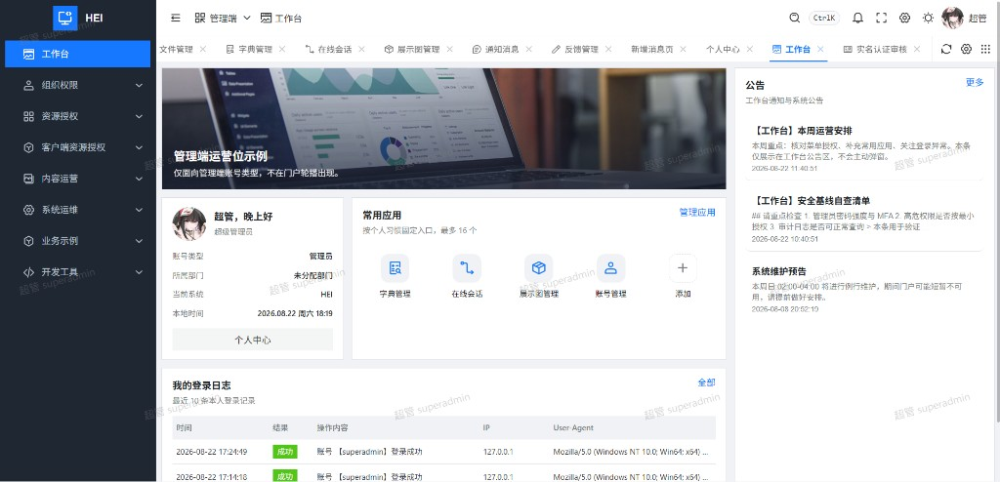</td>
  </tr>
  <tr>
    <td align="center">工作台</td>
  </tr>
</table>

### 组织权限

账号、角色、部门、用户组、岗位与菜单 / 按钮 / API 资源授权，菜单与路由由后端资源树驱动。

<table>
  <tr>
    <td width="50%">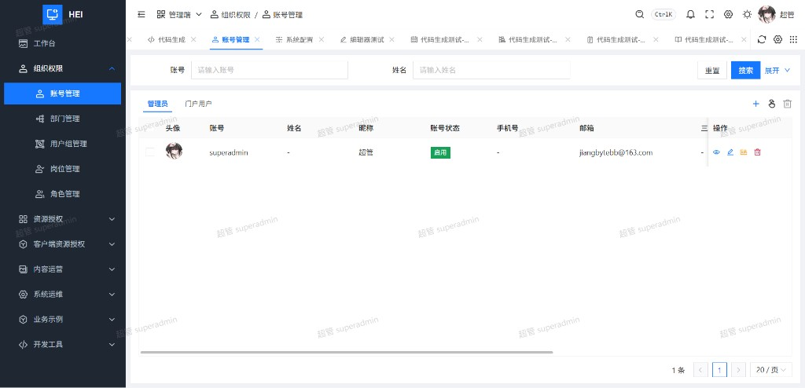</td>
    <td width="50%">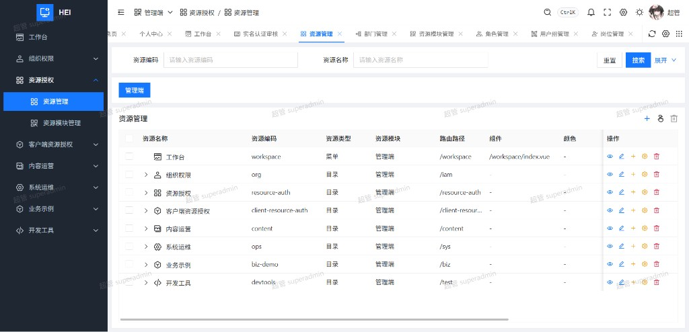</td>
  </tr>
  <tr>
    <td align="center">账号管理</td>
    <td align="center">资源管理</td>
  </tr>
</table>

### 内容运营

Banner 展示位、公告与通知、意见反馈等面向运营侧的配置与发布。

<table>
  <tr>
    <td width="50%">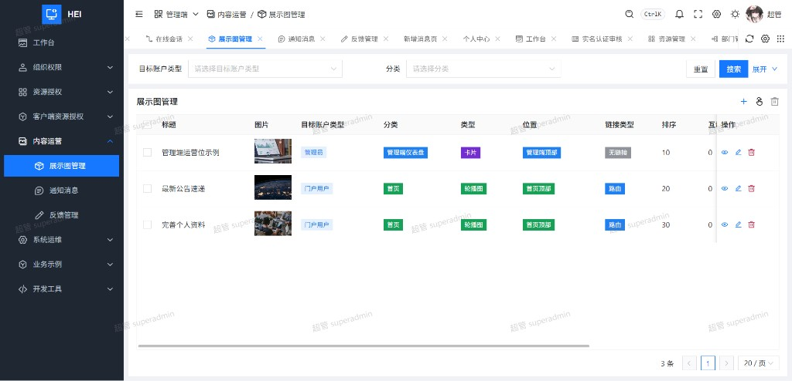</td>
    <td width="50%">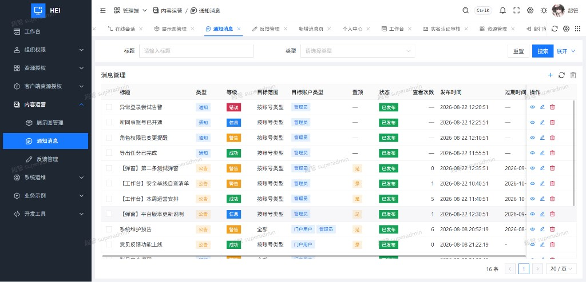</td>
  </tr>
  <tr>
    <td align="center">展示图管理</td>
    <td align="center">通知消息</td>
  </tr>
</table>

### 系统运维

字典、文件、动态配置、任务调度、会话与审计等日常运维能力。

<table>
  <tr>
    <td width="50%">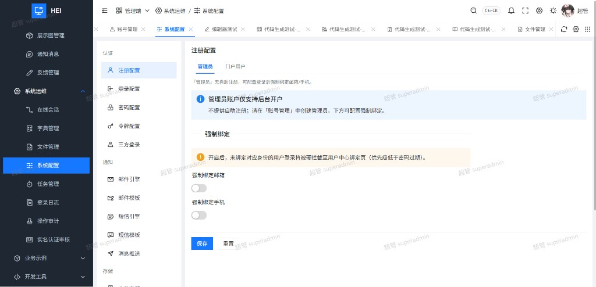</td>
    <td width="50%">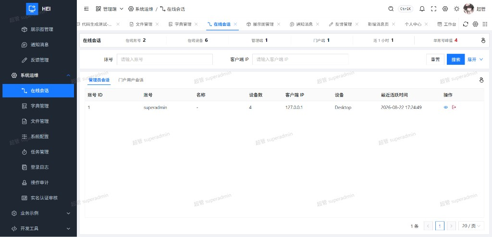</td>
  </tr>
  <tr>
    <td align="center">系统配置</td>
    <td align="center">在线会话</td>
  </tr>
  <tr>
    <td width="50%">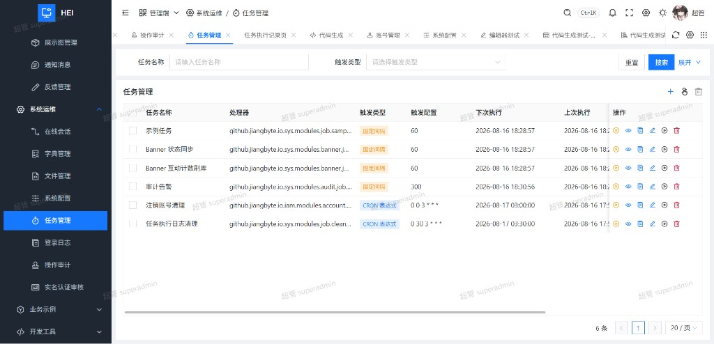</td>
    <td width="50%">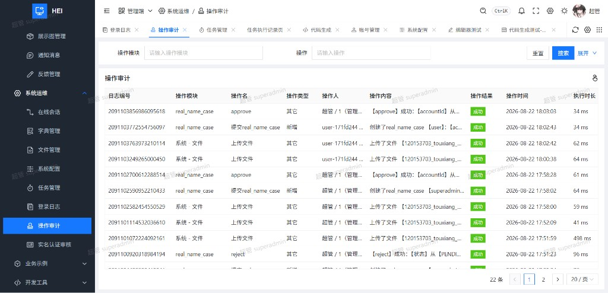</td>
  </tr>
  <tr>
    <td align="center">任务管理</td>
    <td align="center">操作审计</td>
  </tr>
  <tr>
    <td width="50%">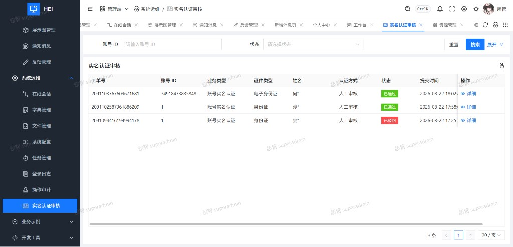</td>
    <td width="50%"></td>
  </tr>
  <tr>
    <td align="center">实名认证审核</td>
    <td></td>
  </tr>
</table>

### 个人中心

资料维护、实名认证、消息、登录日志与安全设置（密码 / 手机 / 邮箱 / 三方绑定 / 账号注销）。

<table>
  <tr>
    <td width="50%">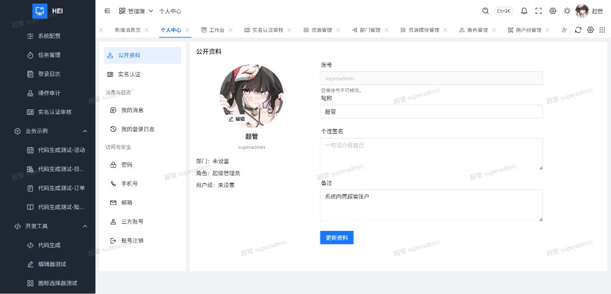</td>
    <td width="50%">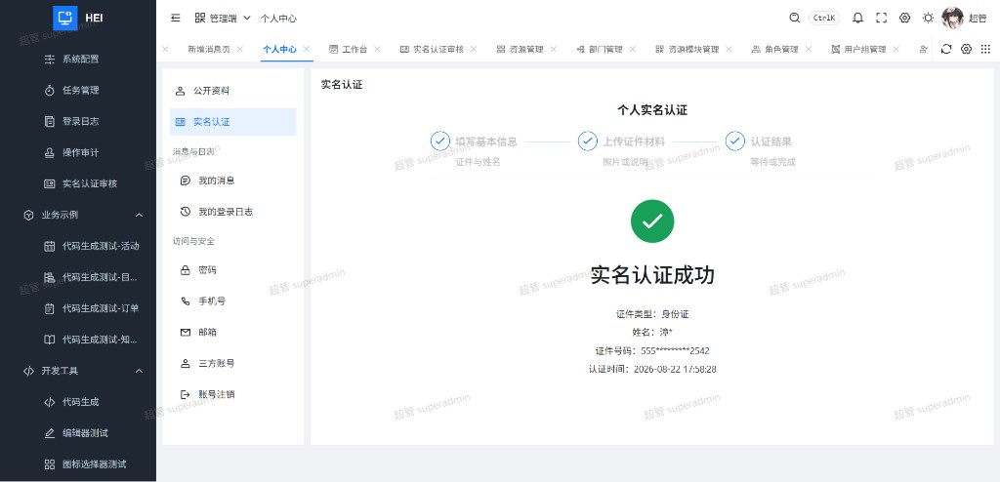</td>
  </tr>
  <tr>
    <td align="center">公开资料</td>
    <td align="center">实名认证</td>
  </tr>
  <tr>
    <td width="50%">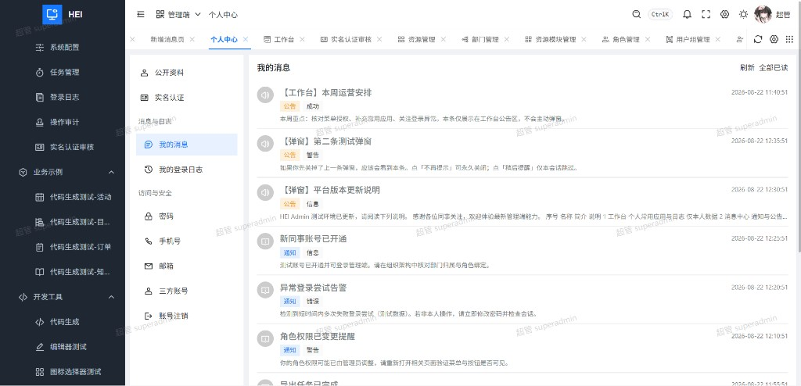</td>
    <td width="50%">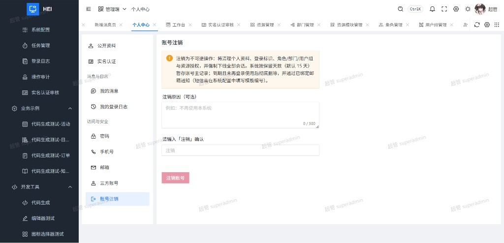</td>
  </tr>
  <tr>
    <td align="center">我的消息</td>
    <td align="center">账号注销</td>
  </tr>
</table>

### 主题配置

支持整体风格、主题色、面包屑 / 多标签、水印等布局与外观项，修改后可实时预览并持久化。

<table>
  <tr>
    <td>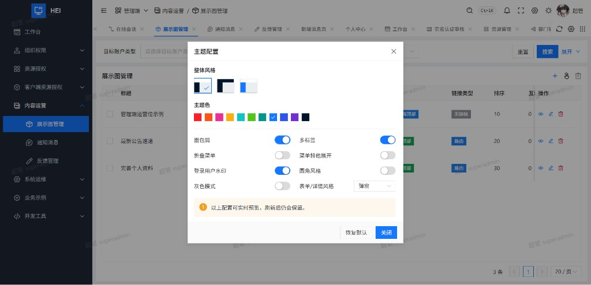</td>
  </tr>
  <tr>
    <td align="center">主题配置</td>
  </tr>
</table>

## 功能特性

HEI Admin 覆盖中后台常见场景，按「认证 → 权限 → 运维 → 运营 → 个人」分层组织：

- **认证与会话**：账号 / 邮箱 / 手机号登录，Cookie 会话，忘记与重置密码；可扩展三方登录（JustAuth，由后端配置）
- **权限与菜单**：动态路由与侧栏菜单来自后端资源树；按钮级 permission key；支持静态路由模式便于本地开发
- **组织与授权**：IAM 模块（账号、角色、部门、用户组、岗位、资源与客户端资源）及授权关系维护
- **系统运维**：字典、配置、文件、任务、弱口令、在线会话、登录日志、操作审计、代码生成等
- **内容与消息**：Banner 运营位、公告 / 通知、意见反馈；工作台聚合展示
- **个人中心**：资料、头像、改密、联系方式绑定、实名认证、消息与账号注销
- **布局体验**：多标签、面包屑、全局搜索、主题与水印；Pro Naive UI 表格 / 表单 / 详情模式

业务菜单与按钮是否可见，取决于后端返回的资源与授权，前端不做硬编码分叉。

## 技术栈

| 类别 | 技术 |
| --- | --- |
| 框架 | Vue 3 · Vite · TypeScript |
| UI | Naive UI · Pro Naive UI · UnoCSS · Iconify |
| 状态与路由 | Pinia · Vue Router |
| 网络 | axios（Cookie 会话，开发期走 Vite 代理） |
| 其他 | AntV G2（图表）、ESLint · Prettier |

## 快速开始

### 环境要求

- Node.js 18+
- pnpm 8+

### 本地运行

```bash
# 建议先启动姊妹后端，默认 http://127.0.0.1:8000
pnpm install
pnpm dev
```

开发地址默认：http://127.0.0.1:5173

### 环境变量

参考 [`.env.example`](.env.example)：

| 变量 | 说明 | 默认 |
| --- | --- | --- |
| `VITE_PORT` | 开发端口 | `5173` |
| `VITE_HOME_PATH` | 登录后首页 | `/workspace` |
| `VITE_ROUTE_LOAD_MODE` | `dynamic` 拉后端菜单；`static` 用本地路由 | `dynamic` |
| `VITE_API_URL` | API 基址；留空则走同源 `/api` | 空 |
| `VITE_API_PROXY_TARGET` | Vite 代理目标 | `http://127.0.0.1:8000` |

生产构建见 [`.env.production`](.env.production)：`VITE_API_URL` 留空，由 nginx 反代 `/api`。

默认演示账号见各后端仓库 README。

## 常用命令

```bash
pnpm dev          # 本地开发
pnpm build        # 类型检查 + 构建
pnpm preview      # 预览构建产物
pnpm lint         # ESLint
pnpm format       # Prettier
```

## Docker

本目录提供 `Dockerfile` 与 `nginx/`（容器内监听 **81**）。

```bash
pnpm build   # 可选；镜像内也会执行 vite build

docker build -t hei-admin .
docker run -d \
  -e BACKEND_URL="http://host.docker.internal:8000" \
  -p 8081:81 \
  hei-admin
```

常用环境变量：`BACKEND_URL`、`CLIENT_MAX_BODY_SIZE`（默认 `10m`）。

## 工程结构

```text
hei-admin/
├── docs/images/     # README 截图
├── nginx/           # 生产 nginx 模板
└── src/
    ├── api/         # 接口封装
    ├── components/  # 通用组件
    ├── layouts/     # 布局壳
    ├── router/      # 路由与守卫
    ├── stores/      # Pinia
    ├── utils/       # 工具
    └── views/       # 页面（auth / iam / sys / workspace / profile …）
```

## 姊妹项目

| 项目 | 说明 | 协议 |
| --- | --- | --- |
| [hei-boot](https://github.com/jiangbyte/hei-boot) | Spring Boot 后端（推荐） | Apache License 2.0 |
| [hei-gin](https://github.com/jiangbyte/hei-gin) | Go / Gin 后端 | Apache License 2.0 |
| [hei-portal](../hei-portal) | 门户前端（React） | Apache License 2.0 |
| [hei-admin-uniapp](../hei-admin-uniapp) | 管理端移动端（uni-app） | Apache License 2.0 |

开发期 Cookie 会话依赖 Vite 同源代理；若将 `VITE_API_URL` 指向跨域后端，需自行配置 CORS 与 Cookie `SameSite`。

## License

本项目基于 [Apache License 2.0](LICENSE) 开源，可自由使用、修改与分发。完整条款见仓库根目录 [LICENSE](LICENSE) 文件。
