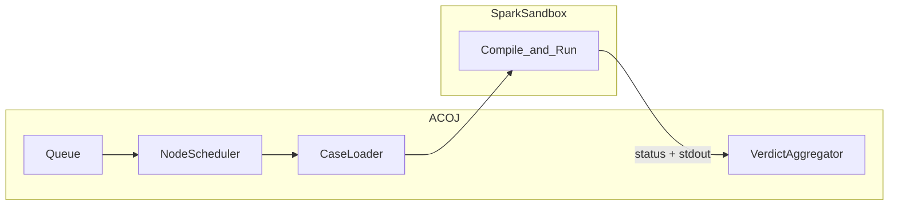
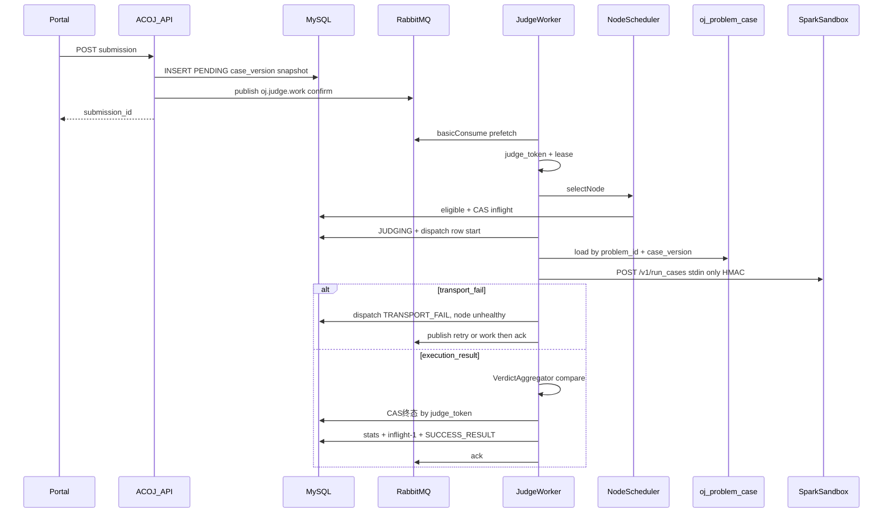

# P0 判题对接设计（SparkSandbox · 生产级调度）

> SparkSandbox **只负责编译与执行**；AC/WA 等裁决在 ACOJ 业务侧计算；期望输出 **永不** 上传沙箱。  
> 数据模型见 [p0-数据库设计.md](./p0-数据库设计.md)；运维见 [p0-判题运维.md](./p0-判题运维.md)。  
> 沙箱契约参考：`E:\projects\mine\SparkSandbox\docs\api.md`。

---

## 1. 职责边界

| 组件 | 负责 | 不负责 |
|------|------|--------|
| SparkSandbox | 编译、限资源跑用户程序、返回 status/stdout/stderr/用量 | AC/WA、测例持久化、队列、用户通知 |
| ACOJ | 队列、选机、测例加载、调用沙箱、比对、聚合、落库、换机/熔断 | 在沙箱内做 checker 判分（P0） |



---

## 2. 端到端序列



---

## 3. RabbitMQ 队列规范

判题子系统 **使用 RabbitMQ 作为唯一任务队列**，不使用 Redis List/Stream/ZSET 做判题排队。平台其它模块若仍用 Redis（会话等）与判题队列无关。

### 3.1 拓扑

| 资源 | 名称 | 说明 |
|------|------|------|
| Exchange | `oj.judge` | `topic`，durable |
| Queue | `oj.judge.work` | 主判题队列，durable；绑定 routing key `work` |
| Queue | `oj.judge.retry` | 延迟重试；durable；消息 TTL 到期经 DLX 进入 `work` |
| Queue | `oj.judge.dlq` | 死信 / 毒消息；绑定 `dlq` |
| DLX | `oj.judge.dlx` | `oj.judge.retry` 的死信交换机，路由到 `oj.judge.work` |

**延迟重试实现（二选一，生产推荐 A）：**

- **A.** 安装 [`rabbitmq_delayed_message_exchange`](https://github.com/rabbitmq/rabbitmq-delayed-message-exchange)，对 `oj.judge` 使用 `x-delayed-message`，发延迟消息直接进 `work`（header `x-delay` 毫秒）。  
- **B.** 经典 TTL + DLX：发到 `oj.judge.retry`，每条设 `expiration`，队列/`x-dead-letter-exchange=oj.judge.dlx`，到期转入 `oj.judge.work`。

### 3.2 消息体（JSON，persistent）

```json
{
  "submission_id": "…",
  "request_id": "…",
  "enqueue_at": 1710000000000,
  "reason": "SUBMIT|FAILOVER|LEASE_REAP|RETRY_BACKOFF"
}
```

- Delivery mode：**persistent**（2）。  
- Publisher：**confirm** 模式；未 confirm 成功则依赖 DB 对账补偿重发。  
- Consumer：**manual ack**；`basic.qos(prefetch)` = 单进程 `worker_concurrency`（或略小）。  
- 处理成功（终态已 CAS 或已改回 PENDING 并再次 publish）后再 **ack**。  
- 不可恢复毒消息（如 submission 不存在）：进 `oj.judge.dlq` 并 ack 原消息，避免无限重投。

### 3.3 在途与单例（不用 Redis）

| 能力 | 方案 |
|------|------|
| 节点 `inflight_count` | **仅 MySQL CAS**（见选机）；权威以 `JUDGING` 聚合对账 |
| HALF_OPEN 探测占位 | `HALF_OPEN` 时 Eligible 额外要求 `inflight_count = 0`（等价只允许 1 路） |
| Heartbeat / Reaper / Reconcile 单例 | `sys_job` 分片或 **ShedLock（JDBC）**；禁止用 Redis 锁做判题单例 |

---

## 4. 配置键（`sys_config`）

| 键 | 默认 | 说明 |
|----|------|------|
| `oj.judge.heartbeat_interval_ms` | `5000` | 探活间隔 |
| `oj.judge.heartbeat_fail_threshold` | `3` | 连续失败 → OFFLINE |
| `oj.judge.circuit_fail_threshold` | `5` | 连续传输失败 → OPEN |
| `oj.judge.circuit_open_ms` | `30000` | OPEN 冷却后转 HALF_OPEN |
| `oj.judge.max_dispatch_per_submission` | `3` | 单提交最大派发（含换机） |
| `oj.judge.max_wait_ms` | `600000` | 无可用节点最长等待后 SE |
| `oj.judge.lease_seconds` | `180` | ≥ 单次 HTTP 超时 + 余量 |
| `oj.judge.zombie_requeue_scan_ms` | `15000` | 租约扫描间隔 |
| `oj.judge.worker_concurrency` | `8` | 单进程 Worker 并发 |
| `oj.judge.case_parallelism` | `4` | 传给沙箱的 case 并行度 |
| `oj.judge.stop_on_first_error` | `true` | 练习题默认 ACM 风格提前停跑 |
| `oj.judge.default_signing_secret_cipher` | — | 节点未配密钥时的全局密文 |
| `oj.judge.inline_case_max_bytes` | `262144` | 超过则强制 OBJECT |
| `oj.judge.sandbox_raw_max_bytes` | `65536` | `sandbox_raw` 截断上限 |
| `oj.judge.real_time_factor` | `3` | `real_time_ms ≈ time_limit_ms * factor` |
| `oj.judge.mq.exchange` | `oj.judge` | 交换机名 |
| `oj.judge.mq.work_queue` | `oj.judge.work` | 主队列 |
| `oj.judge.mq.retry_queue` | `oj.judge.retry` | 延迟队列（方案 B） |
| `oj.judge.mq.dlq` | `oj.judge.dlq` | 死信队列 |
| `oj.judge.mq.prefetch` | `8` | 与 worker 并发对齐 |

连接串走应用配置（如 `spring.rabbitmq.*`），不进业务表。生产 **必须** 使用 `oj_judge_node` 表；单 URL 兜底仅限本地开发。

---

## 5. 执行机调度

### 5.1 Eligible

```text
admin_status = ENABLED
runtime_status = ONLINE
circuit_state ∈ {CLOSED, HALF_OPEN}   # OPEN 不可选；HALF_OPEN 仅允许 1 路探测
inflight_count < max_concurrency
supported_languages 为空数组或包含 language
换机：优先 node.id ∉ tried_node_ids
```

- `DRAINING`：不接新任务；在途跑完后再 `DISABLED`。
- `HALF_OPEN`：Eligible 额外要求 `inflight_count = 0`，保证全集群对该节点最多 1 路探测。

### 5.2 选机：加权最小负载

```text
load_score = (inflight + 1) / max(max_concurrency, 1) / max(weight, 1)
```

1. 在 Eligible 中取 `load_score` 最小。  
2. 并列：`priority` 升序。  
3. 再并列：`hash(request_id) % n` 打散。  

占坑（必须原子，失败则重选，最多有限次）：

```text
UPDATE oj_judge_node
SET inflight_count = inflight_count + 1, last_selected_at = NOW(6)
WHERE id = ? AND epoch = ?
  AND inflight_count < max_concurrency
  AND admin_status = 'ENABLED' AND runtime_status = 'ONLINE'
  AND circuit_state IN ('CLOSED', 'HALF_OPEN')
-- HALF_OPEN：改为 AND inflight_count = 0
-- affected = 0 → 换机重选
```

领取 submission：

```text
judge_token = new_uuid()
judge_lease_owner = worker_id
judge_lease_until = now + lease_seconds
status = JUDGING
dispatch_count += 1
tried_node_ids append node_id
插入 oj_judge_dispatch（started，attempt_no = dispatch_count）
```

### 5.3 熔断

| 事件 | 动作 |
|------|------|
| 连续传输失败 ≥ `circuit_fail_threshold` | `circuit_state=OPEN`，`runtime_status=UNHEALTHY`，记 `circuit_opened_at` |
| OPEN 持续 ≥ `circuit_open_ms` | → `HALF_OPEN`，记 `circuit_half_open_at` |
| HALF_OPEN 探测 `SUCCESS_RESULT` | → `CLOSED`，失败计数清零，可 `ONLINE` |
| HALF_OPEN 探测仍失败 | → `OPEN`，延长冷却 |

**探活成功不得单独关熔断**（避免 health 通但 `run_cases` 全挂）。关熔断条件：`SUCCESS_RESULT` 或 HALF_OPEN 探测成功。

### 5.4 探活（单例）

通过 `sys_job` / ShedLock（JDBC）保证集群单例，间隔 `heartbeat_interval_ms`：

1. 对 `admin_status ∈ {ENABLED, DRAINING}` 的节点：`GET {base_url}/v1/health`。  
2. 成功：更新 `last_heartbeat_at`、`probe_latency_ms`。  
3. 探活连续失败 ≥ `heartbeat_fail_threshold`：`runtime_status=OFFLINE`，`epoch = epoch + 1`。  
4. 探活成功且 `circuit_state ≠ OPEN`：可将 `OFFLINE/UNHEALTHY` 恢复为 `ONLINE`（OPEN 保持，等熔断逻辑）。

### 5.5 瞬时死机与换机

**可换机（基础设施）：**

- 连接拒绝、DNS 失败、HTTP 客户端超时  
- HTTP 502 / 503 / 504  
- 响应无法解析  
- 响应体顶层 `internal_error` 且无有效 compile/cases（P0：先换机 1 次，仍失败再按耗尽规则处理）

**不可换机（用户结果）：**

- `compile_failed` → CE  
- TLE / MLE / OLE / RE / security_violation  
- `succeeded` 后业务比对得到的 AC / WA  

**换机步骤：**

1. 结束 `oj_judge_dispatch`：`TRANSPORT_FAIL` / `TIMEOUT` / `SANDBOX_INTERNAL`。  
2. 节点：`consecutive_fail++`、`total_transport_fail++`；必要时 `UNHEALTHY` + 熔断；**DB** `inflight-1`；硬死亡可 `epoch++`。  
3. submission：若 `dispatch_count < max_dispatch` 且存在 Eligible → `PENDING`，向 RabbitMQ `work` 立即 publish（或短 `x-delay`）。  
4. 否则设置 `next_retry_at`，指数退避 1s/2s/5s/… capped 60s，publish 到 **延迟通道**（delayed exchange 或 `oj.judge.retry`）。  
5. 自首次入队起等待超过 `max_wait_ms` → CAS 落 `SE`，`error_code=NODE_UNAVAILABLE`。

### 5.6 租约与僵尸回收（单例）

`sys_job` / ShedLock 单例扫描：

```text
SELECT * FROM oj_submission
WHERE status = 'JUDGING' AND judge_lease_until < NOW(6)
```

对每行：

1. 将 status 改回 `PENDING`（条件：仍为 `JUDGING` 且匹配原 `judge_token`）。  
2. 对应节点 DB `inflight-1`（同一 token 只减一次：dispatch 记 `CANCELLED_LEASE` 防双减）。  
3. 写/更新 dispatch `CANCELLED_LEASE`。  
4. **RabbitMQ** publish `oj.judge.work`（`reason=LEASE_REAP`），publisher confirm。  

**防双写终态：**

```sql
UPDATE oj_submission SET ...终态...
WHERE id = ? AND status = 'JUDGING' AND judge_token = ?;
```

影响行数为 0 → 丢弃结果（可能已被 Reaper 回收）。

投递语义：**至少一次**执行；换机可重复跑同一提交。

---

## 6. 测例加载

1. 按 submission 快照：`problem_id` + `case_version` + `status=ENABLED` 查询 `oj_problem_case`，按 `sort_no` 排序。  
2. `INLINE`：读 `input_text` / `output_text`。  
3. `OBJECT`：按 object key 经 common-oss 读取，**不**查 `sys_file`。  
4. 组装沙箱 cases：仅 `case_id=case_key` + `stdin`（极大时可临时上传沙箱 FileStore，TTL 短，非权威）；**不传** answer / checker。  

测例版本化写路径见 [数据库设计 §3.1–3.2](./p0-数据库设计.md)。

---

## 7. 调用 SparkSandbox

### 7.1 `POST {base_url}/v1/run_cases`

```json
{
  "language": "cpp17",
  "source": "...",
  "cases": [
    { "case_id": "1", "stdin": "..." }
  ],
  "stop_on_first_error": true,
  "case_parallelism": 4,
  "limits": {
    "cpu_time_ms": 1000,
    "real_time_ms": 3000,
    "memory_bytes": 268435456,
    "stack_bytes": null,
    "output_bytes": null
  }
}
```

- 字段名是 **`source`**，不是 `code`。  
- `real_time_ms = time_limit_ms * oj.judge.real_time_factor`。  
- HTTP 200 仍可能业务失败；以 body `status` 为准。  
- 客户端超时 ≥ compile 限额 + Σ case wall + jitter；**每节点独立连接池**。

### 7.2 HMAC

生产强制开启。头：

- `X-Spark-Timestamp`  
- `X-Spark-Nonce`  
- `X-Spark-Signature` = `hex(HMAC-SHA256(secret, "{ts}\n{nonce}"))`  

密钥：节点 `signing_secret_cipher` 解密优先，否则全局默认密文。

### 7.3 适配组件

| 组件 | 职责 |
|------|------|
| `NodeScheduler` | Eligible、选机、占坑、熔断状态迁移 |
| `NodeHeartbeatJob` | 探活单例 |
| `LeaseReaper` | 僵尸回收单例 |
| `SparkSandboxClient` | 按 node 签名调用 run_cases / health |
| `CaseLoader` | 按 case_version 加载测例 |
| `VerdictAggregator` | **唯一**产生 AC/WA 与整单 status |
| `JudgeWorker` | 消费队列、编排上述组件 |

---

## 8. 业务裁决

### 8.1 执行状态 → 测点/整单中间态

| 沙箱信号 | ACOJ |
|----------|------|
| 顶层/compile `compile_failed` | `CE` |
| case `time_limit_exceeded` | `TLE` |
| case `memory_limit_exceeded` | `MLE` |
| case `output_limit_exceeded` | `OLE` |
| case `runtime_error` / `security_violation` | `RE` |
| `internal_error` / 传输失败 | 走调度换机；耗尽 → `SE` |
| case `succeeded` | 进入比对 |

### 8.2 文本比对（P0 写死）

对期望输出与 stdout：

1. 按 `\n` 拆行（统一 `\r\n` → `\n`）。  
2. 每行 `RTRIM`（去行末空白）。  
3. 去掉全文末尾多余空行后比较。  
4. **不**忽略行内中间空格。  

一致 → 测点 `AC`；否则 `WA`。

### 8.3 整单聚合

- `stop_on_first_error=true`：取首个非 AC 测点状态为整单（CE 在跑测点前已整单结束）。  
- 若跑完全部：优先级 **CE > SE > RE > TLE > MLE > OLE > WA > AC**。  
- P0 `score`：整单 AC → 100，否则 0。

### 8.4 落库顺序

1. CAS 更新 submission 终态（token 校验）。  
2. 结束 dispatch：`SUCCESS_RESULT` + `user_verdict`。  
3. 节点 `inflight-1`、`total_success++`、失败计数清零；可关 HALF_OPEN。  
4. UPSERT `oj_user_problem_stat`；题目 `submit_count`/`accept_count` 可用事务内更新或异步纠偏 + 对账。

---

## 9. 入队与对账

**入队：** `INSERT PENDING` 成功后向 RabbitMQ `oj.judge.work` **publisher confirm** 发布；confirm 失败则依赖对账 Job 补偿。

**补偿入队（每分钟，单例）：** 扫描 `status=PENDING` 且 `queued_at` 已超过阈值、近期无对应成功消费的行，重新 publish（消息可重复，Worker 靠 DB 状态幂等）。无法用「队列深度」精确反查是否在途，故以 **DB 状态 + 时间窗** 为准，并限制重复 publish 频率（如同一 submission 60s 内最多补偿 1 次）。

**在途对账（每分钟，单例）：**

1. 按 `judge_node_id` 聚合 `status=JUDGING` 计数。  
2. 与 DB `oj_judge_node.inflight_count` 比较。  
3. 偏差 → 告警，并以 **JUDGING 聚合** 修复 `inflight_count`。

**延迟重试：** 由 RabbitMQ 延迟插件或 `oj.judge.retry` TTL+DLX 自动回到 `work`，**不**使用 Redis ZSET。

**DLQ：** 定期巡检 `oj.judge.dlq` 深度；人工处理毒消息。

---

## 10. `case_results` / 错误码

**case_results：** 见数据库设计。

**常见 `error_code` / `last_dispatch_error`：**

| 码 | 含义 |
|----|------|
| `NO_ONLINE_NODE` | 当前无 Eligible 节点 |
| `NODE_UNAVAILABLE` | 等待超时 SE |
| `TRANSPORT_FAIL` | 连接/协议失败 |
| `TIMEOUT` | HTTP 超时 |
| `LEASE_EXPIRED` | 租约回收 |
| `CAS_REJECTED` | 终态 CAS 失败（内部） |

---

## 11. 修订记录

| 版本 | 说明 |
|------|------|
| P0 | 生产级调度 + 只执行/业务裁决对接；队列改为 RabbitMQ |
