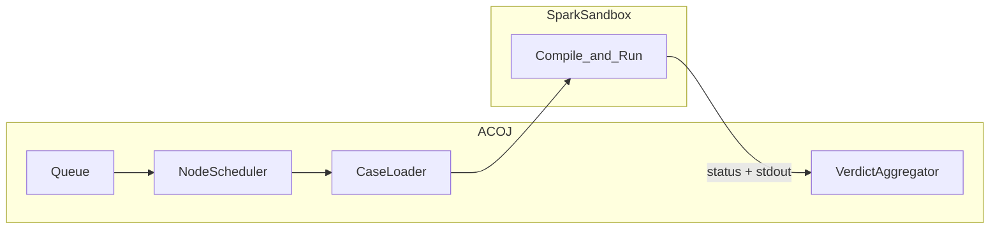
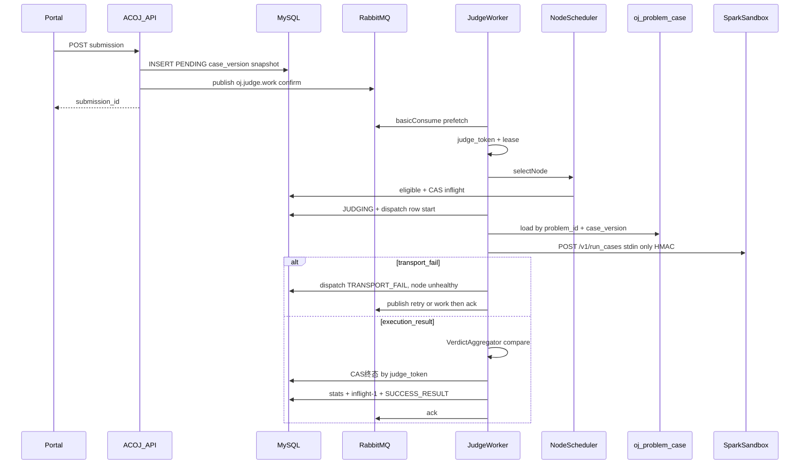

# P0 判题对接设计（SparkSandbox · 生产级调度）

> SparkSandbox **只负责编译与执行**；AC/WA 等裁决在 ACOJ 业务侧计算；期望输出 **永不** 上传沙箱。  
> 数据模型见 [p0-数据库设计.md](./p0-数据库设计.md)；运维见 [p0-判题运维.md](./p0-判题运维.md)。  
> 沙箱契约参考：`E:\projects\mine\SparkSandbox\docs\api.md`。

---

## 1. 职责边界

| 组件 | 负责 | 不负责 |
|------|------|--------|
| SparkSandbox | 编译、限资源跑用户程序、返回 status/stdout/stderr/用量 | AC/WA、测例持久化、队列、用户通知 |
| ACOJ | 队列、选机、测例加载、调用沙箱、比对、聚合、落库、换机/熔断 | 在沙箱内做 checker 判分（P0） |



---

## 2. 端到端序列



---

## 3. RabbitMQ 队列规范

判题子系统 **使用 RabbitMQ 作为唯一任务队列**，不使用 Redis List/Stream/ZSET 做判题排队。平台其它模块若仍用 Redis（会话等）与判题队列无关。

### 3.1 拓扑

| 资源 | 名称 | 说明 |
|------|------|------|
| Exchange | `oj.judge` | `topic`，durable |
| Queue | `oj.judge.work` | 主判题队列，durable；绑定 routing key `work` |
| Queue | `oj.judge.retry` | 延迟重试；durable；消息 TTL 到期经 DLX 进入 `work` |
| Queue | `oj.judge.dlq` | 死信 / 毒消息；绑定 `dlq` |
| DLX | `oj.judge.dlx` | `oj.judge.retry` 的死信交换机，路由到 `oj.judge.work` |

**延迟重试实现（二选一，生产推荐 A）：**

- **A.** 安装 [`rabbitmq_delayed_message_exchange`](https://github.com/rabbitmq/rabbitmq-delayed-message-exchange)，对 `oj.judge` 使用 `x-delayed-message`，发延迟消息直接进 `work`（header `x-delay` 毫秒）。  
- **B.** 经典 TTL + DLX：发到 `oj.judge.retry`，每条设 `expiration`，队列/`x-dead-letter-exchange=oj.judge.dlx`，到期转入 `oj.judge.work`。

### 3.2 消息体（JSON，persistent）

```json
{
  "submission_id": "…",
  "request_id": "…",
  "enqueue_at": 1710000000000,
  "reason": "SUBMIT|FAILOVER|LEASE_REAP|RETRY_BACKOFF|COMPENSATE"
}
```

- Delivery mode：**persistent**（2）。  
- Publisher：**confirm** 模式；未 confirm 成功则依赖 DB 对账补偿重发。  
- Consumer：**manual ack**；`basic.qos(prefetch)` = 单进程 `worker_concurrency`（或略小）。  
- 处理成功（终态已 CAS 或已改回 PENDING 并再次 publish）后再 **ack**。  
- 不可恢复毒消息（如 submission 不存在）：进 `oj.judge.dlq` 并 ack 原消息，避免无限重投。  
- Worker：若 `PENDING` 且 `next_retry_at > now`，**ack 跳过**（不二次 `publishRetry`，防风暴）。

### 3.3 在途与单例

| 能力 | 方案 |
|------|------|
| 节点 `inflight_count` | **仅 MySQL CAS**（见选机）；权威以 `JUDGING` 聚合对账 |
| HALF_OPEN 探测占位 | `HALF_OPEN` 时 Eligible 额外要求 `inflight_count = 0`（等价只允许 1 路） |
| Heartbeat / Reaper / PendingEnqueue / InflightReconcile 单例 | **`sys_job` + 现有 `JobExecutionService` Lock4j**（`sys:job:run:{jobId}`）；不为判题队列另起 Redis 锁；业务正确性仍靠行级 CAS |

---

## 4. 配置键（`sys_config`）

| 键 | 默认 | 说明 |
|----|------|------|
| `oj.judge.heartbeat_stale_ms` | `90000` | 被动心跳超时 → OFFLINE |
| `oj.judge.heartbeat_stale_scan_ms` | `15000` | stale 扫描间隔 |
| `oj.judge.auth_skew_seconds` | `300` | 入站心跳时间戳允许偏差 |
| `oj.judge.circuit_fail_threshold` | `5` | 连续传输失败 → OPEN |
| `oj.judge.circuit_open_ms` | `30000` | OPEN 冷却后转 HALF_OPEN |
| `oj.judge.max_dispatch_per_submission` | `3` | 单提交最大派发（含换机） |
| `oj.judge.max_wait_ms` | `600000` | 无可用节点最长等待后 SE |
| `oj.judge.lease_seconds` | `180` | ≥ 单次 HTTP 超时 + 余量 |
| `oj.judge.zombie_requeue_scan_ms` | `15000` | 租约扫描间隔 |
| `oj.judge.worker_concurrency` | `8` | 单进程 Worker 并发 |
| `oj.judge.case_parallelism` | `4` | 传给沙箱的 case 并行度 |
| `oj.judge.stop_on_first_error` | `true` | 练习题默认 ACM 风格提前停跑 |
| `oj.judge.default_signing_secret` | — | 与沙箱 `signing_secret` 相同明文（P0）；入站心跳验签 + 出站回落 |
| `oj.judge.inline_case_max_bytes` | `262144` | 超过则强制 OBJECT |
| `oj.judge.sandbox_raw_max_bytes` | `65536` | `sandbox_raw` 截断上限 |
| `oj.judge.real_time_factor` | `3` | `real_time_ms ≈ time_limit_ms * factor` |
| `oj.judge.mq.exchange` | `oj.judge` | 交换机名 |
| `oj.judge.mq.work_queue` | `oj.judge.work` | 主队列 |
| `oj.judge.mq.retry_queue` | `oj.judge.retry` | 延迟队列（方案 B） |
| `oj.judge.mq.dlq` | `oj.judge.dlq` | 死信队列 |
| `oj.judge.mq.prefetch` | `8` | 与 worker 并发对齐 |

> 已废弃主动探活键：`heartbeat_interval_ms` / `heartbeat_fail_threshold`（ACOJ→沙箱 `GET /v1/health`）。节点由沙箱主动心跳自注册。

连接串走应用配置（如 `spring.rabbitmq.*`），不进业务表。生产 **必须** 使用 `oj_judge_node` 表；单 URL 兜底仅限本地开发。

---

## 5. 执行机调度

### 5.1 Eligible

```text
admin_status = ENABLED
runtime_status = ONLINE
circuit_state ∈ {CLOSED, HALF_OPEN}   # OPEN 不可选；HALF_OPEN 仅允许 1 路探测
inflight_count < max_concurrency
supported_languages 为空数组 → 兼容全部；非空则须包含 language（忽略大小写）
language 为空且节点已声明语言表 → 不可选
换机：优先 node.id ∉ tried_node_ids
```

- `DRAINING`：不接新任务；在途跑完后再 `DISABLED`。
- `HALF_OPEN`：Eligible 额外要求 `inflight_count = 0`，保证全集群对该节点最多 1 路探测。

### 5.2 选机：加权最小负载

```text
load_score = (inflight + 1) / max(max_concurrency, 1) / max(weight, 1)
```

1. 在 Eligible 中取 `load_score` 最小。  
2. 并列：`priority` 升序。  
3. 再并列：`hash(request_id) % n` 打散。  

占坑（必须原子，失败则重选，最多有限次）：

```text
UPDATE oj_judge_node
SET inflight_count = inflight_count + 1, last_selected_at = NOW(6)
WHERE id = ? AND epoch = ?
  AND inflight_count < max_concurrency
  AND admin_status = 'ENABLED' AND runtime_status = 'ONLINE'
  AND circuit_state IN ('CLOSED', 'HALF_OPEN')
-- HALF_OPEN：改为 AND inflight_count = 0
-- affected = 0 → 换机重选
```

领取 submission：

```text
judge_token = new_uuid()
judge_lease_owner = worker_id
judge_lease_until = now + lease_seconds
status = JUDGING
dispatch_count += 1
tried_node_ids append node_id
插入 oj_judge_dispatch（started，attempt_no = dispatch_count）
```

### 5.3 熔断

| 事件 | 动作 |
|------|------|
| 连续传输失败 ≥ `circuit_fail_threshold` | `circuit_state=OPEN`，`runtime_status=UNHEALTHY`，记 `circuit_opened_at` |
| OPEN 持续 ≥ `circuit_open_ms` | → `HALF_OPEN`，记 `circuit_half_open_at` |
| HALF_OPEN 探测 `SUCCESS_RESULT` | → `CLOSED`，失败计数清零，可 `ONLINE` |
| HALF_OPEN 探测仍失败 | → `OPEN`，延长冷却 |

**探活成功不得单独关熔断**（避免 health 通但 `run_cases` 全挂）。关熔断条件：`SUCCESS_RESULT` 或 HALF_OPEN 探测成功。  
心跳刷新 **不得** 清零 `consecutive_fail_count`。

### 5.4 主动心跳与自注册（单例扫描）

沙箱开启 `heartbeat_enabled` 后，周期性 `POST` ACOJ：

`POST /api/v1/internal/oj/sandbox/heartbeat`

- **无需登录**（`/api/*/internal/**` 白名单）；**强制 HMAC**（三个 `X-Spark-*` 头）。
- **Body 为 AES-256-GCM 密文信封**（线上无业务明文）：

```json
{ "v": 1, "alg": "A256GCM", "iv": "<b64>", "ciphertext": "<b64>" }
```

- 接收流程：验签 → 用同一 `signing_secret` 派生 AES 密钥解密（AAD = `utf8(X-Spark-Timestamp)`）→ 得到明文 JSON（`node` / `listen` / `capacity` / …）。
- ACOJ 推导：
  - `code` = `{hostname}:{listen.port}`
  - **新建**时 `base_url` = `http://{primary_ip||ips[0]}:{port}`（无可用 IP → 400，仅作初始占位）
  - **后续心跳不覆盖** `base_url`；Admin 运维按 ACOJ→沙箱 实际可达地址维护（如本地 Docker/WSL 填 `http://127.0.0.1:8080`）
  - `max_concurrency` ← `capacity.max_concurrency`
  - `supported_languages` ← `languages.keys`（同 `/v1/languages`）
  - `runtime_status=ONLINE`（非 OPEN），刷新 `last_heartbeat_at`；**不覆盖** `weight` / `priority` / `admin_status` / `name` / `base_url`；**不清零** `consecutive_fail_count`
- 新建行默认 `weight=100`、`priority=100`、`admin_status=ENABLED`、`signing_enabled=true`（出站密钥回落全局默认）。
- `extra` 存 version/resources/pool/compile_cache/languages 等摘要（可截断）。

被动超时 Job（`heartbeat_stale_scan_ms`）：`last_heartbeat_at` 早于 `now - heartbeat_stale_ms` 且原为 `ONLINE` → `OFFLINE`，`epoch += 1`。

**OJ 不再**主动 `GET {base_url}/v1/health` 探活各 SparkSandbox。

Admin：不提供新建执行机；运维可改 **base_url** / 权重 / 优先级 / 排水 / 展示名，可删除脏节点。

**语言目录聚合**（题目允许语言 / 门户提交下拉）：

| 端 | 路径 | 说明 |
|----|------|------|
| Admin | `GET /api/v1/admin/oj/judge-nodes/languages` | 权限 `oj:judgenode:page` |
| Portal | `GET /api/v1/portal/oj/languages` | 需门户登录 |

对 `admin_status=ENABLED` 节点的非空 `supported_languages` 做 union 去重排序；空列表节点跳过。响应：`{ languages, node_count }`（不含节点地址等敏感字段）。

### 5.5 瞬时死机与换机

**可换机（基础设施）：**

- 连接拒绝、DNS 失败、HTTP 客户端超时  
- HTTP 502 / 503 / 504（及更一般的 `httpStatus==0` 或 `>=500`）  
- 响应无法解析  
- 响应体顶层 `internal_error` 且无有效 compile/cases（P0：先换机 1 次，仍失败再按耗尽规则处理）

**不可换机（用户结果 / 非 infra）：**

- `compile_failed` → CE  
- TLE / MLE / OLE / RE / security_violation  
- `succeeded` 后业务比对得到的 AC / WA  
- HTTP 4xx 等非基础设施错误 → 关本轮 dispatch 后直接 `SE`（`error_code=SANDBOX_REJECT`），**不**消耗换机配额

**换机步骤：**

1. CAS 结束 `oj_judge_dispatch`：`TRANSPORT_FAIL` / `TIMEOUT` / `SANDBOX_INTERNAL`（`finished_at IS NULL`）；**仅 affected=1 时**再 `inflight-1` / 熔断记账。  
2. 节点：`consecutive_fail++`、`total_transport_fail++`；必要时 `UNHEALTHY` + 熔断；硬死亡可 `epoch++`。  
3. submission：若 `dispatch_count < max_dispatch` 且存在 Eligible → `PENDING`，向 RabbitMQ `work` 立即 publish（或短 `x-delay`）。  
4. 否则设置 `next_retry_at`，指数退避 1s/2s/5s/… capped 60s，publish 到 **延迟通道**（delayed exchange 或 `oj.judge.retry`）。  
5. 自首次入队起等待超过 `max_wait_ms` → CAS 落 `SE`，`error_code=NODE_UNAVAILABLE`。

### 5.6 租约与僵尸回收（单例）

`sys_job` / ShedLock 单例扫描：

```text
SELECT * FROM oj_submission
WHERE status = 'JUDGING' AND judge_lease_until < NOW(6)
```

对每行：

1. 将 status 改回 `PENDING`（条件：仍为 `JUDGING` 且匹配原 `judge_token`）。  
2. 对应节点 DB `inflight-1`（同一 token 只减一次：dispatch 记 `CANCELLED_LEASE` 防双减）。  
3. 写/更新 dispatch `CANCELLED_LEASE`。  
4. **RabbitMQ** publish `oj.judge.work`（`reason=LEASE_REAP`），publisher confirm。  

**防双写终态：**

```sql
UPDATE oj_submission SET ...终态...
WHERE id = ? AND status = 'JUDGING' AND judge_token = ?;
```

影响行数为 0 → 丢弃结果（可能已被 Reaper 回收）。

投递语义：**至少一次**执行；换机可重复跑同一提交。

---

## 6. 测例加载

1. 按 submission 快照：`problem_id` + `case_version` + `status=ENABLED` 查询 `oj_problem_case`，按 `sort_no` 排序。  
2. `INLINE`：读 `input_text` / `output_text`。  
3. `OBJECT`：按 `input_object_key` / `output_object_key` 经默认对象存储（`StorageEngineFactory`）读取 UTF-8 文本，**不**查 `sys_file`。  
4. 组装沙箱 cases：仅 `case_id=case_key` + `stdin`（极大时可临时上传沙箱 FileStore，TTL 短，非权威）；**不传** answer / checker。  

测例版本化写路径见 [数据库设计 §3.1–3.2](./p0-数据库设计.md)。

---

## 7. 调用 SparkSandbox

### 7.1 `POST {base_url}/v1/run_cases`

```json
{
  "language": "cpp17",
  "source": "...",
  "cases": [
    { "case_id": "1", "stdin": "..." }
  ],
  "stop_on_first_error": true,
  "case_parallelism": 4,
  "limits": {
    "cpu_time_ms": 1000,
    "real_time_ms": 3000,
    "memory_bytes": 268435456,
    "stack_bytes": null,
    "output_bytes": null
  }
}
```

- 字段名是 **`source`**，不是 `code`。  
- `real_time_ms = time_limit_ms * oj.judge.real_time_factor`。  
- HTTP 200 仍可能业务失败；以 body `status` 为准。  
- 客户端超时 ≥ compile 限额 + Σ case wall + jitter；**每节点独立连接池**。

### 7.2 HMAC + 心跳密文（双向）

生产强制开启。头：

- `X-Spark-Timestamp`  
- `X-Spark-Nonce`  
- `X-Spark-Signature` = `hex(HMAC-SHA256(secret, "{ts}\n{nonce}"))`  

Canonical **不**绑定 method/path/body。入站心跳另校验时间 skew（`auth_skew_seconds`）与 nonce 防重放。

**主动心跳 body（沙箱 → ACOJ）** 额外 AES-256-GCM：

| 项 | 规则 |
|----|------|
| 信封 | `v=1`，`alg=A256GCM`，`iv`/`ciphertext` 均为 base64 |
| AES 密钥 | `SHA256("spark-sandbox-heartbeat-aes256-v1" \|\| 0x00 \|\| utf8(secret))`（32 字节） |
| AAD | `utf8(X-Spark-Timestamp)`（与请求头完全一致） |
| 明文 | UTF-8 JSON（`node`/`listen`/`capacity`/…） |

密钥：节点 `signing_secret_cipher`（P0 明文）优先用于出站；入站心跳与密钥派生用全局 `hei.oj.judge.default-signing-secret`（`OJ_JUDGE_DEFAULT_SIGNING_SECRET`）。**必须与沙箱 `SPARK_SANDBOX_SIGNING_SECRET` 相同。**

| 方向 | 用途 |
|------|------|
| 沙箱 → ACOJ | 主动心跳：HMAC 头 + AES-GCM 信封；ACOJ 验签后解密再 upsert |
| ACOJ → 沙箱 | `run_cases`，节点 `signing_enabled=true` 时加签（body 明文 JSON） |

### 7.3 适配组件

| 组件 | 职责 |
|------|------|
| `NodeScheduler` | Eligible、选机、占坑、熔断状态迁移 |
| `OjJudgeHeartbeatJob` | 被动心跳超时 OFFLINE + 熔断半开推进 |
| `InternalSandboxHeartbeatController` | 验签 + AES-GCM 解密心跳信封并 upsert 节点 |
| `SparkSandboxHeartbeatCrypto` | 心跳信封密钥派生与解密 |
| `LeaseReaper` | 僵尸回收单例 |
| `SparkSandboxClient` | 按 node 签名调用 run_cases（无主动 health 探活） |
| `CaseLoader` | 按 case_version 加载测例 |
| `VerdictAggregator` | **唯一**产生 AC/WA 与整单 status |
| `JudgeWorker` | 消费队列、编排上述组件 |

---

## 8. 业务裁决

### 8.1 执行状态 → 测点/整单中间态

| 沙箱信号 | ACOJ |
|----------|------|
| 顶层/compile `compile_failed` | `CE` |
| case `time_limit_exceeded` | `TLE` |
| case `memory_limit_exceeded` | `MLE` |
| case `output_limit_exceeded` | `OLE` |
| case `runtime_error` / `security_violation` | `RE` |
| `internal_error` / 传输失败 | 走调度换机；耗尽 → `SE` |
| case `succeeded` | 进入比对 |

### 8.2 文本比对（P0 写死）

对期望输出与 stdout：

1. 按 `\n` 拆行（统一 `\r\n` → `\n`）。  
2. 每行 `RTRIM`（去行末空白）。  
3. 去掉全文末尾多余空行后比较。  
4. **不**忽略行内中间空格。  

一致 → 测点 `AC`；否则 `WA`。

### 8.3 整单聚合

- `stop_on_first_error=true`：取首个非 AC 测点状态为整单（CE 在跑测点前已整单结束）。  
- 若跑完全部：优先级 **CE > SE > RE > TLE > MLE > OLE > WA > AC**。  
- 提交 `score`：按测例 `score` 加权，`round(100 * ΣAC分值 / Σ全部分值)`；测例分值全为 0 时等权；整单 AC → 100，CE/SE → 0。

### 8.4 落库顺序

1. CAS 更新 submission 终态（token 校验）。  
2. 结束 dispatch：`SUCCESS_RESULT` + `user_verdict`。  
3. 节点 `inflight-1`、`total_success++`、失败计数清零；可关 HALF_OPEN。  
4. UPSERT `oj_user_problem_stat`；题目 `submit_count`/`accept_count` 可用事务内更新或异步纠偏 + 对账。

---

## 9. 入队与对账

**入队：** `INSERT PENDING` 成功后向 RabbitMQ `oj.judge.work` **publisher confirm** 发布；confirm 失败则依赖对账 Job 补偿。

**补偿入队（`OjJudgePendingEnqueueJob`，FIXED 60s，sys_job+Lock4j）：**

- 扫描：`status=PENDING` 且 `queued_at` 超过阈值，且 `(next_retry_at IS NULL OR next_retry_at <= now)`；`ORDER BY queued_at` + `LIMIT 100`。  
- **先占位再 publish**：写入 `extra.compensate_at`，距上次补偿 ≥ 60s 才 `affected=1`；再 `publishWork(reason=COMPENSATE)`。  
- 消息可重复，Worker 靠 DB 状态幂等；禁止无界全表扫。

**在途对账（`OjJudgeInflightReconcileJob`，FIXED 60s）：**

1. 一次 `GROUP BY judge_node_id` 聚合 `status=JUDGING`。  
2. 与 `oj_judge_node.inflight_count` 比较。  
3. 仅漂移时乐观 `UPDATE ... SET inflight_count=? WHERE id=? AND inflight_count=?`；打 warn。短暂 ±1 竞态下周期收敛。

**延迟重试：** 由 RabbitMQ 延迟插件或 `oj.judge.retry` TTL+DLX 自动回到 `work`，**不**使用 Redis ZSET。

**DLQ：** 定期巡检 `oj.judge.dlq` 深度；人工处理毒消息。

种子脚本：`server/scripts/oj_p0_insert_judge_reconcile_jobs.sql`（含 Heartbeat / LeaseReaper / PendingEnqueue / InflightReconcile）。
---

## 10. `case_results` / 错误码

**case_results：** 见数据库设计。

**常见 `error_code` / `last_dispatch_error`：**

| 码 | 含义 |
|----|------|
| `NO_ONLINE_NODE` | 当前无 Eligible 节点 |
| `NODE_UNAVAILABLE` | 等待超时 SE |
| `TRANSPORT_FAIL` | 连接/协议失败 |
| `TIMEOUT` | HTTP 超时 |
| `LEASE_EXPIRED` | 租约回收 |
| `SANDBOX_REJECT` | 非 infra 失败（如 4xx），不换机直接 SE |
| `CAS_REJECTED` | 终态 CAS 失败（内部） |

---

## 11. 管理端试跑（参考答案预验证）

管理端同步试跑**不入** `oj_submission` / MQ，直接选机 → `run_cases` → 业务裁决 → 落 `oj_problem_dry_run`。

| `limit_mode` | 沙箱限额 |
|--------------|----------|
| `PROBLEM` | 题目 `time_limit_ms` / `memory_limit_bytes`；`real_time_ms` = 时限 × `real_time_factor` |
| `RELAXED` | `hei.oj.judge.dry-run-relaxed-cpu-time-ms`（默认 30s）/ `dry-run-relaxed-memory-bytes`（默认 1GiB） |

发布门禁只认当前 `case_version` 上 `mode=ALL` + `limit_mode=PROBLEM` + `overall_status=AC`。

配置：`dry-run-time-factor`（默认 3）、`dry-run-memory-factor`（默认 2）。

---

## 12. 修订记录

| 版本 | 说明 |
|------|------|
| P0 | 生产级调度 + 只执行/业务裁决对接；队列改为 RabbitMQ；主动心跳自注册 |
| P0.1 | 管理端试跑双限额模式 + 发布门禁 |
