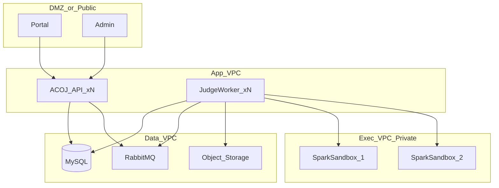

# P0 判题运维设计（生产级）

> 配套：[数据库设计](./p0-数据库设计.md) · [判题对接](./p0-判题对接.md)

---

## 1. 部署拓扑



**硬性要求：**

| 项 | 要求 |
|----|------|
| 网络 | SparkSandbox **仅内网**；安全组允许 Worker 访问沙箱端口，并允许沙箱访问 ACOJ 心跳入口（`8000` 内部路径） |
| 沙箱容器 | `--privileged --cgroupns=host`（见下方启动命令） |
| ACOJ | API 与 Worker 可同进程或拆分；Worker 可水平扩展 |
| 判题队列 | **RabbitMQ**（durable + confirm + manual ack）；**不用 Redis 做判题队列** |
| 执行机登记 | **沙箱主动心跳自注册**写入 `oj_judge_node`；Admin **不新建**，仅改权重/排水 |
| 签名 | 生产双向 HMAC + 心跳 AES-GCM；`OJ_JUDGE_DEFAULT_SIGNING_SECRET` ≡ `SPARK_SANDBOX_SIGNING_SECRET` |

本地开发：配置同一密钥后按下方 `docker run` 拉起沙箱即可自注册；**首次心跳**会写入 `base_url` 占位（常为容器/WSL 内网 IP），请在 Admin 执行机列表将该地址改为 ACOJ 实际可达地址（如 `http://127.0.0.1:8080`），后续心跳不会覆盖。

### 1.1 SparkSandbox 容器启动（对接 ACOJ 心跳）

```bash
docker rm -f spark-sandbox 2>/dev/null || true

docker run -d --name spark-sandbox \
  --privileged --cgroupns=host \
  -p 8080:8080 \
  --add-host=host.docker.internal:host-gateway \
  -e SPARK_SANDBOX_SIGNING_ENABLED=1 \
  -e SPARK_SANDBOX_SIGNING_SECRET='your-long-random-secret' \
  -e SPARK_SANDBOX_HEARTBEAT_ENABLED=1 \
  -e SPARK_SANDBOX_HEARTBEAT_URL='http://host.docker.internal:8000/api/v1/internal/oj/sandbox/heartbeat' \
  -e SPARK_SANDBOX_HEARTBEAT_INTERVAL_SECONDS=30 \
  registry.cn-beijing.aliyuncs.com/czbyte/spark-sandbox:0.1.1
```

开启时须配置非空 `heartbeat_url` 与 `signing_secret`。心跳**始终加签**，且 **body 始终 AES-256-GCM 加密**（密钥由同一 `signing_secret` 派生；AAD 绑定 `X-Spark-Timestamp`）。ACOJ 验签后解密再登记节点。

OJ 侧同步：

```bash
export OJ_JUDGE_DEFAULT_SIGNING_SECRET='your-long-random-secret'
```

（`application-dev.yml`：`hei.oj.judge.default-signing-secret`）

RabbitMQ 建议：镜像队列或 Quorum Queue（生产优先 **quorum** `oj.judge.work`）；开启延迟插件或配置 TTL+DLX；监控队列深度与 DLQ。

平台会话等仍可能使用 Redis，与判题排队解耦。

---

## 2. 密钥与配置

| 秘密 | 存放 | 注意 |
|------|------|------|
| 双向 HMAC / 心跳 AES 明文（P0） | 环境变量 `OJ_JUDGE_DEFAULT_SIGNING_SECRET` / `hei.oj.judge.default-signing-secret` | 与沙箱 `SPARK_SANDBOX_SIGNING_SECRET` **必须相同**；用于入站心跳验签+解密与出站 `run_cases` 回落 |
| 节点 HMAC（可选覆盖） | `oj_judge_node.signing_secret_cipher` | P0 暂存明文；空则用全局默认 |
| OSS 凭证 | 现有对象存储配置 | 测例 OBJECT 私有读 |

**日志脱敏：**

- 禁止打印 HMAC secret、完整源码、完整测例 I/O。  
- 源码可记 `sha256` 前 16 位；stdout 仅在 `sandbox_raw` 截断字段落库。  
- Admin 审计查看源码走鉴权接口，不进普通应用日志。

配置变更（时限系数、熔断阈值等）走 `sys_config`，变更后 Worker 热加载或短 TTL 缓存（≤ 30s）。

---

## 3. SLO（默认目标）

| 指标 | 目标 |
|------|------|
| 探活失败 → 标记 `OFFLINE` | ≤ `heartbeat_stale_ms`（默认 90s，另加扫描间隔） |
| 传输失败 → 换机再入队 | ≤ 2s（不含下一次判题耗时） |
| 租约过期 → 重入队 | ≤ `zombie_requeue_scan_ms + 处理时间`（默认约 15–30s） |
| 队列等待 p99（有可用容量时） | 按业务容量规划；建议告警阈值见下节 |
| 可用性 | 至少 2 台 Eligible 执行机；单机维护用 `DRAINING` |

非目标：沙箱侧 exactly-once；P0 为至少一次执行。

---

## 4. 指标

建议导出 Prometheus（或等价）：

| 指标 | 标签 | 说明 |
|------|------|------|
| `oj_judge_queue_depth` | `queue` | RabbitMQ `oj.judge.work` / `retry` / `dlq` 深度 |
| `oj_judge_pending_age_seconds` | quantile | PENDING 年龄 |
| `oj_node_inflight` | `node_code` | DB 在途 |
| `oj_node_runtime_status` | `node_code`, `status` | gauge 枚举 |
| `oj_node_circuit_state` | `node_code`, `state` | |
| `oj_dispatch_total` | `outcome` | 派发结果计数 |
| `oj_verdict_total` | `status` | 用户终态 |
| `oj_judge_e2e_ms` | — | 入队到终态 |
| `oj_sandbox_http_ms` | `node_code` | 调用耗时 |
| `oj_lease_reap_total` | — | 租约回收次数 |
| `oj_inflight_reconcile_drift` | — | DB 在途对账偏差 |
| `oj_mq_publish_confirm_fail` | — | publisher confirm 失败次数 |

结构化日志字段建议：`request_id`、`submission_id`、`node_id`、`attempt_no`、`outcome`、`worker_id`。

---

## 5. 告警

| 级别 | 条件 | 动作 |
|------|------|------|
| P0 | Eligible 节点数 = 0 持续 > 1min | 值班；用户侧大量 PENDING |
| P0 | `oj_inflight_reconcile_drift` > 0 持续 > 5min | 查 Worker 崩溃/双减 |
| P1 | 单节点 `OPEN` 持续 > 5min | 查沙箱/网络 |
| P1 | `queue_depth`（work）> 阈值（如 500）或 `pending_age_p99` > 120s | 扩容节点或 Worker |
| P1 | `oj.judge.dlq` 深度 > 0 持续 | 处理毒消息 |
| P1 | `oj_mq_publish_confirm_fail` 升高 | 查 RabbitMQ 集群 |
| P1 | `lease_reap_total` 速率异常升高 | 租约过短或 Worker 卡死 |
| P2 | 单节点 `OFFLINE` | 维护或重启沙箱 |
| P2 | `SE` / `NODE_UNAVAILABLE` 比率升高 | 容量或全员故障 |

通知可复用现有审计告警 webhook（`sys` 配置）。

---

## 6. 容量估算（经验公式）

设：

- 单节点 `max_concurrency = C`  
- 平均单次 `run_cases` 墙钟 `T` 秒  
- 节点数 `N`（ONLINE 且 CLOSED）  

近似吞吐：

```text
throughput ≈ N * C / T   （提交/秒）
```

例：`N=2`，`C=4`，`T=2s` → 约 4 提交/秒。高峰按 3× 冗余选 `N` 或提高 `C`（且不超过沙箱自身 `max_concurrency`）。

Worker 进程并发：`oj.judge.worker_concurrency` 建议 ≤ 全局 `Σ C`，避免本地排队掩盖节点过载。

测例：INLINE 控制单行大小；大测例 OBJECT，注意 Worker 与 OSS 带宽。

---

## 7. 日常运维操作

### 7.1 上线新执行机

1. 部署 SparkSandbox（内网、privileged、签名密钥与 ACOJ 一致）。  
2. Admin 插入 `oj_judge_node`：`admin_status=ENABLED`，`max_concurrency`/`weight` 按机器规格。  
3. 等待探活变为 `ONLINE`。  
4. 观察 `oj_dispatch_total` 与错误率。

### 7.2 下线 / 维护

1. `admin_status=DRAINING`（不再接新任务）。  
2. 等待 `inflight_count=0` 且无新 dispatch。  
3. `admin_status=DISABLED` 或停容器。  
4. 禁止在有在途时直接杀光所有节点（除非接受 SE/等待）。

### 7.3 密钥轮换

1. 沙箱与 ACOJ 准备新 secret。  
2. 短时双密钥窗口（若沙箱仅支持单密钥，则维护窗口 `DRAINING` 全部节点，滚动更新）。  
3. 更新 `signing_secret_cipher` / 全局密文。  
4. 验证 `run_cases` 401 率为 0。

### 7.4 派发审计清理

- 默认保留 **90 天** `oj_judge_dispatch`。  
- `sys_job`：删除 `started_at < now - 90d`；高峰期避开。  
- 旧测例版本：无进行中提交引用且 `case_version < problem.case_version - K` 时清理行与 OSS（K 默认 5 或按天）。

---

## 8. 对账任务

| Job | 锁 | 周期 | 行为 |
|-----|-----|------|------|
| Heartbeat Stale | ShedLock/JDBC 或 sys_job | 15s | 超时未心跳 → OFFLINE |
| Lease Reaper | 同上 | 15s | 回收僵尸 JUDGING 并 MQ 再入队 |
| Inflight Reconcile | 同上 | 60s | JUDGING 聚合修复 DB `inflight_count` |
| Pending Enqueue | 同上 | 60s | PENDING 补偿 publish 到 RabbitMQ |
| Dispatch Purge | sys_job | 日 | 审计表清理 |

对账修复原则：以 **`status=JUDGING` 按 node 聚合计数** 为权威修正 `oj_judge_node.inflight_count`；偏差写入指标与告警。队列积压直接看 RabbitMQ 管理指标，**不**用 Redis。

---

## 9. 故障演练清单

上线前至少演练一次并记录结果：

| # | 场景 | 期望 |
|---|------|------|
| 1 | `kill -9` 沙箱进程 | 心跳超时 OFFLINE / 传输失败换机；提交最终有结果或等待后 SE |
| 2 | 对沙箱断网 | 同换机；熔断 OPEN |
| 3 | 沙箱磁盘满导致 internal_error | 换机或 SE；有 dispatch 审计 |
| 4 | kill ACOJ Worker | 租约过期重入队；无双终态（token CAS） |
| 5 | 双节点轮流挂 | 流量打到存活节点；全挂则 PENDING 后 SE |
| 6 | 判题中修改测例发新 version | 旧提交仍按旧 `case_version` 裁决 |
| 7 | HALF_OPEN 探测 | 仅 1 路；成功关熔断 |
| 8 | DRAINING | 无新任务；在途完成 |
| 9 | RabbitMQ 滚动重启 / 断连 | confirm 失败走补偿；quorum + persistent 不丢消息 |

---

## 10. 安全基线检查表

- [ ] 执行机无公网 IP 或端口不对公网开放  
- [ ] 生产验签开启且 secret 非默认值  
- [ ] 测例 bucket/前缀私有，无公开 ACL  
- [ ] 日志无 secret/全量源码  
- [ ] Admin 执行机与重判接口需权限码  
- [ ] `oj_judge_dispatch.extra` 无敏感全文  

---

## 11. 修订记录

| 版本 | 说明 |
|------|------|
| P0 | 主动心跳自注册；被动 stale；双向 HMAC 与 docker run 模板 |
