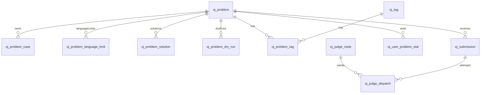
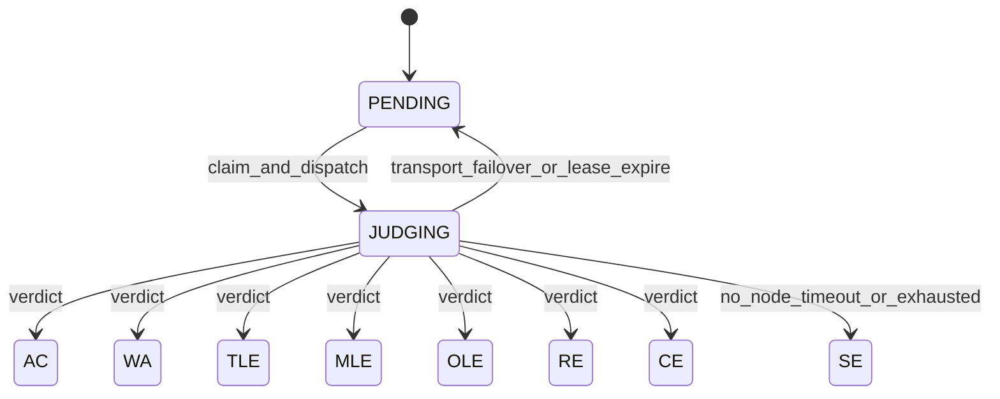

# P0 数据库设计（可刷题 · 生产级）

> 对齐工程约定：`id varchar(64)` 雪花、`created_at/by` + `updated_at/by`、`datetime(6)`、无软删列、状态 `varchar(32)` UPPER_SNAKE、关联 ID 应用层约束（无 DB FK）。  
> 测例 **禁止** 复用 `sys_file`；执行机以 `oj_judge_node` + `oj_judge_dispatch` 为真相。  
> 配套：[判题对接](./p0-判题对接.md) · [判题运维](./p0-判题运维.md)

---

## 1. ER 关系



| 表 | 职责 |
|----|------|
| `oj_problem` | 题目主数据；`case_version` 防换包错判 |
| `oj_problem_language_limit` | 题目 × 语言资源限额（判题/试跑真相） |
| `oj_problem_case` | 题目测例（INLINE / OBJECT），归属 `problem_id` |
| `oj_problem_solution` | 多语言参考答案（管理端试跑用） |
| `oj_problem_dry_run` | 管理端测例试跑历史 |
| `oj_tag` / `oj_problem_tag` | 标签及关联 |
| `oj_submission` | 提交 + 调度控制字段 |
| `oj_user_problem_stat` | 用户×题做题统计 |
| `oj_judge_node` | 执行机（SparkSandbox）登记与运行态 |
| `oj_judge_dispatch` | 每次派发审计 |

实施时可落独立脚本 `server/scripts/oj_p0.sql`，或并入 `hei_boot.sql`。

---

## 2. 枚举约定

### 2.1 题目

| 字段 | 取值 |
|------|------|
| `difficulty` | `EASY` / `MEDIUM` / `HARD` |
| `judge_mode` | P0 固定 `STANDARD`（业务侧文本比对） |
| `status` | `DRAFT` / `PUBLISHED` / `DISABLED` |

发布为 `PUBLISHED` 前须满足：当前 `case_version` ≥1 条 ENABLED 测例、≥1 条语言限额、≥1 条 ENABLED 参考答案、存在一次 `mode=ALL` 且 `limit_mode=PROBLEM` 且整单 `AC` 的试跑记录。

### 2.2 测例

| 字段 | 取值 |
|------|------|
| `input_storage` / `output_storage` | `INLINE` / `OBJECT` |
| `status` | `ENABLED` / `DISABLED` |

OBJECT 对象键约定：

```text
oj/problem/{problem_id}/v{case_version}/case/{case_key}.in
oj/problem/{problem_id}/v{case_version}/case/{case_key}.out
```

阈值建议：单测例 ≤ 256KiB 用 `INLINE`；更大用 `OBJECT`（走 common-oss，**不**写 `sys_file`）。

### 2.3 参考答案 / 试跑

| 字段 | 取值 |
|------|------|
| `oj_problem_solution.status` | `ENABLED` / `DISABLED` |
| `oj_problem_dry_run.mode` | `SINGLE` / `ALL` |
| `oj_problem_dry_run.limit_mode` | `PROBLEM`（题面限额）/ `RELAXED`（宽松摸底） |
| `oj_problem_dry_run.source_from` | `STORED` / `OVERRIDE` |
| `oj_problem_dry_run.overall_status` | `PENDING` / `JUDGING` / 提交终态：`AC` / `WA` / … / `SE` |

### 2.4 提交（用户可见）

`PENDING` → `JUDGING` → 终态之一：

`AC` / `WA` / `TLE` / `MLE` / `OLE` / `RE` / `CE` / `SE`

调度等待无节点时保持 `PENDING`，并写 `last_dispatch_error`（如 `NO_ONLINE_NODE`）。

### 2.5 做题统计

`oj_user_problem_stat.status`：`ATTEMPTED` / `ACCEPTED`

### 2.6 执行机

| 字段 | 取值 |
|------|------|
| `admin_status` | `ENABLED` / `DISABLED` / `DRAINING` |
| `runtime_status` | `ONLINE` / `OFFLINE` / `UNHEALTHY` |
| `circuit_state` | `CLOSED` / `OPEN` / `HALF_OPEN` |

### 2.7 派发审计 `outcome`

`STARTED`（进行中） / `SUCCESS_RESULT` / `TRANSPORT_FAIL` / `SANDBOX_INTERNAL` / `CANCELLED_LEASE` / `TIMEOUT`

---

## 3. DDL

字符集一律 `utf8mb4` / `utf8mb4_unicode_ci`，引擎 InnoDB。

### 3.1 `oj_problem`

```sql
DROP TABLE IF EXISTS `oj_problem`;
CREATE TABLE `oj_problem` (
  `id` varchar(64) NOT NULL COMMENT '主键ID',
  `problem_key` varchar(32) NOT NULL COMMENT '对外题号，如 P1001',
  `title` varchar(255) NOT NULL COMMENT '标题',
  `statement_md` mediumtext NOT NULL COMMENT '题面 Markdown',
  `input_format` text NULL COMMENT '输入格式说明',
  `output_format` text NULL COMMENT '输出格式说明',
  `hint` text NULL COMMENT '提示',
  `samples` json NOT NULL COMMENT '题面样例 [{input,output,explanation?}]',
  `difficulty` varchar(32) NOT NULL COMMENT 'EASY/MEDIUM/HARD',
  `judge_mode` varchar(32) NOT NULL DEFAULT 'STANDARD' COMMENT 'P0: STANDARD',
  `case_version` int NOT NULL DEFAULT 1 COMMENT '测例变更版本；提交时快照',
  `status` varchar(32) NOT NULL COMMENT 'DRAFT/PUBLISHED/DISABLED',
  `submit_count` int NOT NULL DEFAULT 0 COMMENT '提交总数（冗余）',
  `accept_count` int NOT NULL DEFAULT 0 COMMENT 'AC 总数（冗余）',
  `source` varchar(128) NULL COMMENT '来源文案',
  `extra` json NOT NULL COMMENT '扩展信息',
  `created_at` datetime(6) NOT NULL DEFAULT CURRENT_TIMESTAMP(6) COMMENT '创建时间',
  `created_by` varchar(64) NULL COMMENT '创建人',
  `updated_at` datetime(6) NOT NULL DEFAULT CURRENT_TIMESTAMP(6) ON UPDATE CURRENT_TIMESTAMP(6) COMMENT '更新时间',
  `updated_by` varchar(64) NULL COMMENT '更新人',
  PRIMARY KEY (`id`),
  UNIQUE KEY `uk_oj_problem_key` (`problem_key`),
  KEY `idx_oj_problem_status_difficulty` (`status`, `difficulty`),
  KEY `idx_oj_problem_status_created` (`status`, `created_at`)
) ENGINE=InnoDB DEFAULT CHARSET=utf8mb4 COLLATE=utf8mb4_unicode_ci COMMENT='OJ 题目';
```

**资源限额与允许语言：** 以 `oj_problem_language_limit` 为准（题目 × 语言）；有限额行即表示该语言允许提交。

**测例变更（版本化，生产必选）：** 不覆盖旧测例行。同事务：写入新版本全量 `oj_problem_case` 行（`case_version = 旧版+1`），再 `oj_problem.case_version = 新版本`。判题按 submission 快照的 `case_version` 加载，避免换包错判。

### 3.2 `oj_problem_language_limit`

```sql
DROP TABLE IF EXISTS `oj_problem_language_limit`;
CREATE TABLE `oj_problem_language_limit` (
  `id` varchar(64) NOT NULL COMMENT '主键ID',
  `problem_id` varchar(64) NOT NULL COMMENT '所属题目ID',
  `language` varchar(32) NOT NULL COMMENT '语言 key，与 SparkSandbox 一致',
  `time_limit_ms` int NOT NULL COMMENT 'CPU 时限毫秒，对应沙箱 cpu_time_ms',
  `memory_limit_bytes` bigint NOT NULL COMMENT '内存限额字节',
  `stack_limit_bytes` bigint NULL COMMENT '栈限额，空则用沙箱默认',
  `output_limit_bytes` bigint NULL COMMENT '输出限额，空则用沙箱默认',
  `extra` json NOT NULL COMMENT '扩展信息',
  `created_at` datetime(6) NOT NULL DEFAULT CURRENT_TIMESTAMP(6) COMMENT '创建时间',
  `created_by` varchar(64) NULL COMMENT '创建人',
  `updated_at` datetime(6) NOT NULL DEFAULT CURRENT_TIMESTAMP(6) ON UPDATE CURRENT_TIMESTAMP(6) COMMENT '更新时间',
  `updated_by` varchar(64) NULL COMMENT '更新人',
  PRIMARY KEY (`id`),
  UNIQUE KEY `uk_oj_problem_language_limit` (`problem_id`, `language`),
  KEY `idx_oj_problem_language_limit_problem` (`problem_id`)
) ENGINE=InnoDB DEFAULT CHARSET=utf8mb4 COLLATE=utf8mb4_unicode_ci COMMENT='OJ 题目×语言资源限额';
```

### 3.3 `oj_problem_case`

```sql
DROP TABLE IF EXISTS `oj_problem_case`;
CREATE TABLE `oj_problem_case` (
  `id` varchar(64) NOT NULL COMMENT '主键ID',
  `problem_id` varchar(64) NOT NULL COMMENT '所属题目ID',
  `case_version` int NOT NULL COMMENT '测例包版本，与 oj_problem.case_version 对齐',
  `case_key` varchar(64) NOT NULL COMMENT '题内测例号，如 1、sample1',
  `sort_no` int NOT NULL DEFAULT 0 COMMENT '判题与展示顺序',
  `is_sample` tinyint(1) NOT NULL DEFAULT 0 COMMENT '是否样例（可对用户展示）',
  `score` int NOT NULL DEFAULT 0 COMMENT '测例分值；全 0 时等权计分',
  `input_storage` varchar(32) NOT NULL COMMENT 'INLINE/OBJECT',
  `output_storage` varchar(32) NOT NULL COMMENT 'INLINE/OBJECT',
  `input_text` mediumtext NULL COMMENT 'INLINE 输入；OBJECT 时 NULL',
  `output_text` mediumtext NULL COMMENT 'INLINE 期望输出；OBJECT 时 NULL',
  `input_object_key` varchar(512) NULL COMMENT 'OBJECT 输入对象键',
  `output_object_key` varchar(512) NULL COMMENT 'OBJECT 期望输出对象键',
  `input_bytes` int NOT NULL DEFAULT 0 COMMENT '输入字节数',
  `output_bytes` int NOT NULL DEFAULT 0 COMMENT '输出字节数',
  `checksum_sha256` varchar(64) NULL COMMENT '可选校验',
  `status` varchar(32) NOT NULL DEFAULT 'ENABLED' COMMENT 'ENABLED/DISABLED',
  `extra` json NOT NULL COMMENT '扩展信息',
  `created_at` datetime(6) NOT NULL DEFAULT CURRENT_TIMESTAMP(6) COMMENT '创建时间',
  `created_by` varchar(64) NULL COMMENT '创建人',
  `updated_at` datetime(6) NOT NULL DEFAULT CURRENT_TIMESTAMP(6) ON UPDATE CURRENT_TIMESTAMP(6) COMMENT '更新时间',
  `updated_by` varchar(64) NULL COMMENT '更新人',
  PRIMARY KEY (`id`),
  UNIQUE KEY `uk_oj_problem_case_ver_key` (`problem_id`, `case_version`, `case_key`),
  KEY `idx_oj_problem_case_ver_sort` (`problem_id`, `case_version`, `sort_no`)
) ENGINE=InnoDB DEFAULT CHARSET=utf8mb4 COLLATE=utf8mb4_unicode_ci COMMENT='OJ 题目测例（与题目组合，不复用 sys_file）';
```

**约束（应用层）：**

- `INLINE` 时对应 `*_text` 非空，`*_object_key` 为空。
- `OBJECT` 时对应 `*_object_key` 非空，`*_text` 为空。
- OBJECT key 建议带版本：`oj/problem/{problem_id}/v{case_version}/case/{case_key}.in|.out`。
- 上传 zip：解析后写入**新** `case_version` 行集，**不**创建 `sys_file`；旧版本行保留供在途提交。
- 历史版本清理：无 `PENDING/JUDGING` 引用且低于当前版本超过保留期后，由运维任务删除行与 OSS 对象。

### 3.4 `oj_problem_solution`

```sql
DROP TABLE IF EXISTS `oj_problem_solution`;
CREATE TABLE `oj_problem_solution` (
  `id` varchar(64) NOT NULL COMMENT '主键ID',
  `problem_id` varchar(64) NOT NULL COMMENT '所属题目ID',
  `language` varchar(32) NOT NULL COMMENT '语言 key，与 SparkSandbox 一致',
  `source` mediumtext NOT NULL COMMENT '参考答案源码',
  `is_default` tinyint(1) NOT NULL DEFAULT 0 COMMENT '同题默认答案（仅一条为 1）',
  `status` varchar(32) NOT NULL DEFAULT 'ENABLED' COMMENT 'ENABLED/DISABLED',
  `remark` varchar(255) NULL COMMENT '备注',
  `created_at` datetime(6) NOT NULL DEFAULT CURRENT_TIMESTAMP(6) COMMENT '创建时间',
  `created_by` varchar(64) NULL COMMENT '创建人',
  `updated_at` datetime(6) NOT NULL DEFAULT CURRENT_TIMESTAMP(6) ON UPDATE CURRENT_TIMESTAMP(6) COMMENT '更新时间',
  `updated_by` varchar(64) NULL COMMENT '更新人',
  PRIMARY KEY (`id`),
  UNIQUE KEY `uk_oj_problem_solution_lang` (`problem_id`, `language`),
  KEY `idx_oj_problem_solution_problem` (`problem_id`, `status`)
) ENGINE=InnoDB DEFAULT CHARSET=utf8mb4 COLLATE=utf8mb4_unicode_ci COMMENT='OJ 题目多语言参考答案';
```

### 3.5 `oj_problem_dry_run`

```sql
DROP TABLE IF EXISTS `oj_problem_dry_run`;
CREATE TABLE `oj_problem_dry_run` (
  `id` varchar(64) NOT NULL COMMENT '主键ID',
  `problem_id` varchar(64) NOT NULL COMMENT '题目ID',
  `case_version` int NOT NULL COMMENT '试跑时测例版本',
  `mode` varchar(32) NOT NULL COMMENT 'SINGLE/ALL',
  `case_key` varchar(64) NULL COMMENT 'SINGLE 时测例号',
  `limit_mode` varchar(32) NOT NULL COMMENT 'PROBLEM/RELAXED',
  `language` varchar(32) NOT NULL COMMENT '语言 key',
  `source` mediumtext NOT NULL COMMENT '实际执行源码快照',
  `source_from` varchar(32) NOT NULL COMMENT 'STORED/OVERRIDE',
  `overall_status` varchar(32) NOT NULL COMMENT 'AC/WA/TLE/.../SE',
  `max_time_ms` int NULL COMMENT '测点耗时峰值',
  `max_memory_bytes` bigint NULL COMMENT '测点内存峰值',
  `suggested_time_ms` int NULL COMMENT '建议时限毫秒',
  `suggested_memory_bytes` bigint NULL COMMENT '建议内存字节',
  `applied_time_ms` int NULL COMMENT '本次传给沙箱的 CPU 时限',
  `applied_memory_bytes` bigint NULL COMMENT '本次传给沙箱的内存限额',
  `case_results` json NOT NULL DEFAULT ('[]') COMMENT '每测例 verdict/time/memory/message（可截断）',
  `node_id` varchar(64) NULL COMMENT '执行机ID',
  `error_message` varchar(512) NULL COMMENT '传输/系统错误摘要',
  `created_at` datetime(6) NOT NULL DEFAULT CURRENT_TIMESTAMP(6) COMMENT '创建时间',
  `created_by` varchar(64) NULL COMMENT '创建人',
  `updated_at` datetime(6) NOT NULL DEFAULT CURRENT_TIMESTAMP(6) ON UPDATE CURRENT_TIMESTAMP(6) COMMENT '更新时间',
  `updated_by` varchar(64) NULL COMMENT '更新人',
  PRIMARY KEY (`id`),
  KEY `idx_oj_problem_dry_run_problem_created` (`problem_id`, `created_at`),
  KEY `idx_oj_problem_dry_run_publish` (`problem_id`, `case_version`, `mode`, `limit_mode`, `overall_status`)
) ENGINE=InnoDB DEFAULT CHARSET=utf8mb4 COLLATE=utf8mb4_unicode_ci COMMENT='OJ 管理端测例试跑历史';
```

建议限额：`suggested_time_ms = max(1000, ceil(max_time_ms * dry_run_time_factor))`（默认 factor 3）；`suggested_memory_bytes = max(题面内存, ceil(max_memory_bytes * dry_run_memory_factor))` 再向上对齐 1MiB（默认 factor 2）。

### 3.6 `oj_tag` / `oj_problem_tag`

```sql
DROP TABLE IF EXISTS `oj_tag`;
CREATE TABLE `oj_tag` (
  `id` varchar(64) NOT NULL COMMENT '主键ID',
  `name` varchar(128) NOT NULL COMMENT '标签名称',
  `status` varchar(32) NOT NULL DEFAULT 'ENABLED' COMMENT 'ENABLED/DISABLED',
  `created_at` datetime(6) NOT NULL DEFAULT CURRENT_TIMESTAMP(6) COMMENT '创建时间',
  `created_by` varchar(64) NULL COMMENT '创建人',
  `updated_at` datetime(6) NOT NULL DEFAULT CURRENT_TIMESTAMP(6) ON UPDATE CURRENT_TIMESTAMP(6) COMMENT '更新时间',
  `updated_by` varchar(64) NULL COMMENT '更新人',
  PRIMARY KEY (`id`)
) ENGINE=InnoDB DEFAULT CHARSET=utf8mb4 COLLATE=utf8mb4_unicode_ci COMMENT='OJ 题目标签';

DROP TABLE IF EXISTS `oj_problem_tag`;
CREATE TABLE `oj_problem_tag` (
  `id` varchar(64) NOT NULL COMMENT '主键ID',
  `problem_id` varchar(64) NOT NULL COMMENT '题目ID',
  `tag_id` varchar(64) NOT NULL COMMENT '标签ID',
  `created_at` datetime(6) NOT NULL DEFAULT CURRENT_TIMESTAMP(6) COMMENT '创建时间',
  `created_by` varchar(64) NULL COMMENT '创建人',
  `updated_at` datetime(6) NOT NULL DEFAULT CURRENT_TIMESTAMP(6) ON UPDATE CURRENT_TIMESTAMP(6) COMMENT '更新时间',
  `updated_by` varchar(64) NULL COMMENT '更新人',
  PRIMARY KEY (`id`),
  UNIQUE KEY `uk_oj_problem_tag` (`problem_id`, `tag_id`),
  KEY `idx_oj_problem_tag_tag` (`tag_id`)
) ENGINE=InnoDB DEFAULT CHARSET=utf8mb4 COLLATE=utf8mb4_unicode_ci COMMENT='OJ 题目-标签关联';
```

P0 不做标签树。

### 3.7 `oj_submission`

```sql
DROP TABLE IF EXISTS `oj_submission`;
CREATE TABLE `oj_submission` (
  `id` varchar(64) NOT NULL COMMENT '主键ID',
  `problem_id` varchar(64) NOT NULL COMMENT '题目ID',
  `account_id` varchar(64) NOT NULL COMMENT '提交人账户ID',
  `language` varchar(32) NOT NULL COMMENT '语言 key，与 SparkSandbox 一致',
  `source_code` mediumtext NOT NULL COMMENT '源代码',
  `case_version` int NOT NULL COMMENT '提交时题目测例版本快照',
  `status` varchar(32) NOT NULL COMMENT 'PENDING/JUDGING/AC/WA/TLE/MLE/OLE/RE/CE/SE',
  `score` int NOT NULL DEFAULT 0 COMMENT '得分 0-100：AC 测例分值之和 / 总分 ×100；全 AC=100',
  `time_ms` int NULL COMMENT '测点耗时汇总（如峰值或总和，实现写死一种）',
  `memory_bytes` bigint NULL COMMENT '测点内存峰值汇总',
  `compile_output` text NULL COMMENT '编译输出（CE）',
  `judge_message` varchar(512) NULL COMMENT '简短说明',
  `note` varchar(255) NULL COMMENT '用户备注',
  `case_results` json NOT NULL COMMENT '业务裁决后的测点摘要数组',
  `sandbox_raw` json NOT NULL COMMENT '截断后的执行侧摘要（排障）',
  `queued_at` datetime(6) NULL COMMENT '入队时间',
  `judged_at` datetime(6) NULL COMMENT '终态时间',
  `judge_node_id` varchar(64) NULL COMMENT '当前/最后一次派发节点',
  `dispatch_count` int NOT NULL DEFAULT 0 COMMENT '已派发次数（含换机）',
  `tried_node_ids` json NOT NULL COMMENT '已尝试节点 ID 列表',
  `judge_lease_until` datetime(6) NULL COMMENT '领取租约截止',
  `judge_lease_owner` varchar(128) NULL COMMENT 'Worker 实例 ID',
  `judge_token` varchar(64) NULL COMMENT '本次领取 token；终态 CAS 校验',
  `last_dispatch_error` varchar(512) NULL COMMENT '调度/传输错误摘要',
  `next_retry_at` datetime(6) NULL COMMENT '退避重试时间',
  `error_code` varchar(64) NULL COMMENT '如 NODE_UNAVAILABLE',
  `extra` json NOT NULL COMMENT '扩展信息',
  `created_at` datetime(6) NOT NULL DEFAULT CURRENT_TIMESTAMP(6) COMMENT '创建时间',
  `created_by` varchar(64) NULL COMMENT '创建人',
  `updated_at` datetime(6) NOT NULL DEFAULT CURRENT_TIMESTAMP(6) ON UPDATE CURRENT_TIMESTAMP(6) COMMENT '更新时间',
  `updated_by` varchar(64) NULL COMMENT '更新人',
  PRIMARY KEY (`id`),
  KEY `idx_oj_submission_problem_created` (`problem_id`, `created_at`),
  KEY `idx_oj_submission_account_created` (`account_id`, `created_at`),
  KEY `idx_oj_submission_status_queued` (`status`, `queued_at`),
  KEY `idx_oj_submission_lease` (`status`, `judge_lease_until`),
  KEY `idx_oj_submission_retry` (`status`, `next_retry_at`)
) ENGINE=InnoDB DEFAULT CHARSET=utf8mb4 COLLATE=utf8mb4_unicode_ci COMMENT='OJ 提交';
```

**终态幂等（实现必须）：**

```sql
UPDATE oj_submission
SET status = ?, ..., judged_at = ?
WHERE id = ? AND status = 'JUDGING' AND judge_token = ?;
-- 影响行数 = 0 → 丢弃本次结果（租约已被回收或他 Worker 已写）
```

**`case_results` JSON 元素（约定）：**

```json
{
  "case_key": "1",
  "status": "AC",
  "time_ms": 12,
  "memory_bytes": 1048576,
  "message": ""
}
```

不落 `oj_submission_case` 子表（P0）；需要强查时再拆。

### 3.8 `oj_user_problem_stat`

```sql
DROP TABLE IF EXISTS `oj_user_problem_stat`;
CREATE TABLE `oj_user_problem_stat` (
  `id` varchar(64) NOT NULL COMMENT '主键ID',
  `account_id` varchar(64) NOT NULL COMMENT '账户ID',
  `problem_id` varchar(64) NOT NULL COMMENT '题目ID',
  `status` varchar(32) NOT NULL COMMENT 'ATTEMPTED/ACCEPTED',
  `attempt_count` int NOT NULL DEFAULT 0 COMMENT '提交次数',
  `accepted_count` int NOT NULL DEFAULT 0 COMMENT 'AC 次数',
  `first_accepted_at` datetime(6) NULL COMMENT '首次 AC 时间',
  `last_submit_at` datetime(6) NULL COMMENT '最近提交时间',
  `extra` json NOT NULL COMMENT '扩展信息',
  `created_at` datetime(6) NOT NULL DEFAULT CURRENT_TIMESTAMP(6) COMMENT '创建时间',
  `created_by` varchar(64) NULL COMMENT '创建人',
  `updated_at` datetime(6) NOT NULL DEFAULT CURRENT_TIMESTAMP(6) ON UPDATE CURRENT_TIMESTAMP(6) COMMENT '更新时间',
  `updated_by` varchar(64) NULL COMMENT '更新人',
  PRIMARY KEY (`id`),
  UNIQUE KEY `uk_oj_user_problem` (`account_id`, `problem_id`),
  KEY `idx_oj_user_problem_problem` (`problem_id`, `status`)
) ENGINE=InnoDB DEFAULT CHARSET=utf8mb4 COLLATE=utf8mb4_unicode_ci COMMENT='OJ 用户题目统计';
```

列表「已 AC / 未 AC / 未尝试」：左连本表；无行 = 未尝试。

### 3.9 `oj_judge_node`

```sql
DROP TABLE IF EXISTS `oj_judge_node`;
CREATE TABLE `oj_judge_node` (
  `id` varchar(64) NOT NULL COMMENT '主键ID',
  `code` varchar(64) NOT NULL COMMENT '节点编码',
  `name` varchar(128) NOT NULL COMMENT '展示名',
  `base_url` varchar(512) NOT NULL COMMENT 'SparkSandbox 根地址，如 http://10.0.0.11:8080',
  `signing_enabled` tinyint(1) NOT NULL DEFAULT 1 COMMENT '是否对该节点验签',
  `signing_secret_cipher` varchar(1024) NULL COMMENT '节点密钥密文；空则用全局默认',
  `admin_status` varchar(32) NOT NULL DEFAULT 'ENABLED' COMMENT 'ENABLED/DISABLED/DRAINING',
  `runtime_status` varchar(32) NOT NULL DEFAULT 'OFFLINE' COMMENT 'ONLINE/OFFLINE/UNHEALTHY',
  `circuit_state` varchar(32) NOT NULL DEFAULT 'CLOSED' COMMENT 'CLOSED/OPEN/HALF_OPEN',
  `circuit_opened_at` datetime(6) NULL COMMENT '熔断打开时间',
  `circuit_half_open_at` datetime(6) NULL COMMENT '进入半开时间',
  `weight` int NOT NULL DEFAULT 100 COMMENT '调度权重，越大越易被选中',
  `priority` int NOT NULL DEFAULT 100 COMMENT '并列时优先级，越小越优先',
  `max_concurrency` int NOT NULL DEFAULT 4 COMMENT 'ACOJ 侧最大在途',
  `inflight_count` int NOT NULL DEFAULT 0 COMMENT '持久化在途（与 JUDGING 聚合对账；不用 Redis）',
  `epoch` bigint NOT NULL DEFAULT 0 COMMENT '节点世代；OFFLINE/硬故障时递增',
  `total_dispatch` bigint NOT NULL DEFAULT 0 COMMENT '累计派发',
  `total_success` bigint NOT NULL DEFAULT 0 COMMENT '累计成功产出用户结果',
  `total_transport_fail` bigint NOT NULL DEFAULT 0 COMMENT '累计传输失败',
  `consecutive_fail_count` int NOT NULL DEFAULT 0 COMMENT '连续传输/探活失败',
  `last_heartbeat_at` datetime(6) NULL COMMENT '最近探活成功',
  `last_selected_at` datetime(6) NULL COMMENT '最近被选中',
  `last_success_at` datetime(6) NULL COMMENT '最近 SUCCESS_RESULT',
  `last_error_at` datetime(6) NULL COMMENT '最近错误时间',
  `last_error_message` varchar(512) NULL COMMENT '最近错误摘要',
  `probe_latency_ms` int NULL COMMENT '最近探活 RTT',
  `supported_languages` json NOT NULL COMMENT '空数组=全语言；否则白名单',
  `extra` json NOT NULL COMMENT '机房/AZ/备注等',
  `created_at` datetime(6) NOT NULL DEFAULT CURRENT_TIMESTAMP(6) COMMENT '创建时间',
  `created_by` varchar(64) NULL COMMENT '创建人',
  `updated_at` datetime(6) NOT NULL DEFAULT CURRENT_TIMESTAMP(6) ON UPDATE CURRENT_TIMESTAMP(6) COMMENT '更新时间',
  `updated_by` varchar(64) NULL COMMENT '更新人',
  PRIMARY KEY (`id`),
  UNIQUE KEY `uk_oj_judge_node_code` (`code`),
  KEY `idx_oj_judge_node_admin_runtime` (`admin_status`, `runtime_status`, `circuit_state`),
  KEY `idx_oj_judge_node_runtime_inflight` (`runtime_status`, `inflight_count`)
) ENGINE=InnoDB DEFAULT CHARSET=utf8mb4 COLLATE=utf8mb4_unicode_ci COMMENT='OJ 执行机（SparkSandbox）';
```

生产 **禁止** 仅靠单条 `sys_config` URL 作为唯一执行入口；开发环境可临时兜底，见运维文档。

### 3.10 `oj_judge_dispatch`

```sql
DROP TABLE IF EXISTS `oj_judge_dispatch`;
CREATE TABLE `oj_judge_dispatch` (
  `id` varchar(64) NOT NULL COMMENT '主键ID',
  `submission_id` varchar(64) NOT NULL COMMENT '提交ID',
  `node_id` varchar(64) NOT NULL COMMENT '执行机ID',
  `node_epoch` bigint NOT NULL DEFAULT 0 COMMENT '派发时节点 epoch',
  `attempt_no` int NOT NULL COMMENT '该提交第几次派发',
  `worker_id` varchar(128) NOT NULL COMMENT 'Worker 实例 ID',
  `request_id` varchar(64) NOT NULL COMMENT '链路追踪 ID',
  `started_at` datetime(6) NOT NULL COMMENT '开始时间',
  `finished_at` datetime(6) NULL COMMENT '结束时间',
  `duration_ms` int NULL COMMENT '耗时毫秒',
  `outcome` varchar(32) NOT NULL COMMENT 'STARTED/SUCCESS_RESULT/TRANSPORT_FAIL/SANDBOX_INTERNAL/CANCELLED_LEASE/TIMEOUT',
  `http_status` int NULL COMMENT 'HTTP 状态码',
  `error_code` varchar(64) NULL COMMENT '错误码',
  `error_message` varchar(512) NULL COMMENT '错误摘要（脱敏）',
  `user_verdict` varchar(32) NULL COMMENT '本轮用户结果 AC/WA/...；无则 NULL',
  `extra` json NOT NULL COMMENT '摘要扩展；禁止完整源码与超大 stdout',
  `created_at` datetime(6) NOT NULL DEFAULT CURRENT_TIMESTAMP(6) COMMENT '创建时间',
  `created_by` varchar(64) NULL COMMENT '创建人',
  `updated_at` datetime(6) NOT NULL DEFAULT CURRENT_TIMESTAMP(6) ON UPDATE CURRENT_TIMESTAMP(6) COMMENT '更新时间',
  `updated_by` varchar(64) NULL COMMENT '更新人',
  PRIMARY KEY (`id`),
  UNIQUE KEY `uk_oj_judge_dispatch_attempt` (`submission_id`, `attempt_no`),
  KEY `idx_oj_judge_dispatch_node_started` (`node_id`, `started_at`),
  KEY `idx_oj_judge_dispatch_outcome_started` (`outcome`, `started_at`)
) ENGINE=InnoDB DEFAULT CHARSET=utf8mb4 COLLATE=utf8mb4_unicode_ci COMMENT='OJ 派发审计';
```

热数据默认保留 **90 天**，由清理任务归档/删除（见运维文档）。

---

## 4. 提交状态机（库视角）



---

## 5. 与平台表边界

| 能力 | 使用 |
|------|------|
| 账号 / 权限 | 现有 IAM；`account_id` 引用 `sys_account.id`（逻辑） |
| 通用文件（头像等） | `sys_file` |
| **OJ 测例** | **仅** `oj_problem_case` + OSS object key |
| 执行机连接 | **仅** `oj_judge_node`（+ 可选全局默认签名密钥配置） |
| 定时探活 / 清理 | 可挂现有 `sys_job` |

---

## 6. 语言 key（与 SparkSandbox 对齐）

存库与调度一律使用沙箱 language id，例如：

`c11` / `cpp17` / `python3` / `java17` / `go` / `nodejs`

Portal 展示名由前端/字典映射，不另建语言表（P0）。

---

## 7. 修订记录

| 版本 | 说明 |
|------|------|
| P0 | 初稿：可刷题生产级表结构 |
| P0.1 | 增加参考答案 / 试跑历史；发布门禁 |
